# Notes on Agentic AI  

This page is the text book style notes i have made on agentic ai .
Addtionaly there is a full code repo  
[`code/`](code/README.md) where we teach developers diffrent conecpts via inline ,try it your self manner.This repo recomneds hosting LLMs locally via ollma [`docs/setup.md`](docs/setup.md).  

The text is [CC BY-NC-SA 4.0](LICENSE); the code is [MIT](code/LICENSE). See [License](#license) at the end.

## Overview
I started teaching engineers about agentic AI. Over the period I realized that teaching practicing programmers about any new Framework has to be mindful of their prior learning. At times the wisdom gained so far feeds into the new framework and technology paradigm. At times the prior learnings hamper their ability to see nuances and retain curiosity about the new kid.
So my teaching style evolved into using lots of code first to drive in the new point of view. And then supplement that with details on the new tech and also commentary on where it has continuation, breakup, evolution and new beginnings. Over period of time my notes and call transcripts were long enough to motivate me into writing this. This text is very opinionated hence, it also assumes the student has prior understanding of basic building blocks and will dig out more when clues are provided.All the text is written by me, citations have been given where due.  
When it came to coding examples I generated them using  Copilot  . However I realized they were too cryptic. So I took help from Sumit Toshniwal. He is one of the AI Engineers working at Actimize on Agentic projects. First he helped me get a feel of younger generation of developers :). Then he helped me simplify the code examples according to the intended learning outcome. We have kept the code samples minimal and self contained because I am expecting experienced developers will fill in the necessary design blanks. We thank NICE Actimize for being the org where we could do all this as one of the part of the work.

This repo is **dedicated to Prof. Andrew Ng** who is sharing AI related knowledge freely nurturing AI minds across the Globe.

**Quick links:**
- [Notes on Agentic AI](#notes-on-agentic-ai)
  - [Overview](#overview)
- [Basics of LLMs, Prompts and Tool Calls](#basics-of-llms-prompts-and-tool-calls)
  - [What is an Agent?](#what-is-an-agent)
    - [Language Model (LLM)](#language-model-llm)
      - [Prompt Engineering](#prompt-engineering)
      - [Tool Calling (Function Calling)](#tool-calling-function-calling)
- [Foundation of Agentic AI](#foundation-of-agentic-ai)
    - [Retrieval-Augmented Generation (RAG)](#retrieval-augmented-generation-rag)
    - [Advanced RAG](#advanced-rag)
- [Agentic Execution and Patterns](#agentic-execution-and-patterns)
    - [An Agent](#an-agent)
    - [The Agent Loop](#the-agent-loop)
    - [Prompt Chaining](#prompt-chaining)
    - [Multi-Agent Patterns](#multi-agent-patterns)
    - [12 Factors of Agentic Design](#12-factors-of-agentic-design)
    - [Memory](#memory)
    - [Deep Agents](#deep-agents)
    - [LangChain](#langchain)
    - [LangGraph](#langgraph)
    - [DSPy, Embabel, and LlamaIndex](#dspy-embabel-and-llamaindex)
      - [Why these three matter](#why-these-three-matter)
      - [LlamaIndex](#llamaindex)
      - [DSPy](#dspy)
      - [Embabel](#embabel)
      - [How students should compare them](#how-students-should-compare-them)
- [Production Aspects](#production-aspects)
    - [Post-training (out of scope)](#post-training-out-of-scope)
    - [Challenges and Limitations](#challenges-and-limitations)
    - [Hallucinations and Factfulness](#hallucinations-and-factfulness)
    - [Agent Benchmarks and Evaluation](#agent-benchmarks-and-evaluation)
    - [AI Ethics and Bias](#ai-ethics-and-bias)
    - [Context Window Limits](#context-window-limits)
    - [Latency](#latency)
    - [Cost and Resources Utilization](#cost-and-resources-utilization)
    - [Safety and Guardrails](#safety-and-guardrails)
- [Enterprise Suites and Protocols](#enterprise-suites-and-protocols)
  - [References](#references)
  - [License](#license)

**Running the code alongside the text**

| Section of this text | Code to run |
|---|---|
| [Basics of LLMs, Prompts and Tool Calls](#basics-of-llms-prompts-and-tool-calls) | [`code/module01_raw/`](code/module01_raw/), [`code/module02_basics/`](code/module02_basics/) |
| [Foundation of Agentic AI](#foundation-of-agentic-ai) | [`code/module01_raw/1.10_rag_basic/`](code/module01_raw/1.10_rag_basic/), [`code/module03_langchain/`](code/module03_langchain/) |
| [Agentic Execution and Patterns](#agentic-execution-and-patterns) | [`code/module03_langchain/`](code/module03_langchain/), [`code/module08_frameworks/`](code/module08_frameworks/) |
| [Production Aspects](#production-aspects) | [`code/module04_production/`](code/module04_production/), [`code/module05_security/`](code/module05_security/), [`code/module07_evaluation/`](code/module07_evaluation/) |
| [Enterprise Suites and Protocols](#enterprise-suites-and-protocols) | [`code/module06_enterprise/`](code/module06_enterprise/) |

Each module is a numbered sequence of small, self-contained scripts; the full index is in
[`code/README.md`](code/README.md).


---

# Basics of LLMs, Prompts and Tool Calls

This section introduces the concepts related to Agentic AI. We have grouped the concepts in accordance with the code samples in modules, so that learners can quickly test out the concepts.
## What is an Agent?

Classically, an **agent** can be defined as a component that has some perception of its environment and has the ability to perform an action/task. A lot of your home automation devices fit into this definition. This also implies that AI is not a prerequisite for an agent. However, the wave of Agentic AI defines an Agent as a component that has the ability to perform some goal-oriented action with some sort of reasoning and planning capability (with or without direct perception of its environment). It goes without saying that LLMs have significantly enabled agents with the capability to reason and plan. This adds dynamism and adaptability to agents given that LLMs have a generic ability to reason about practically everything.
The hard part of achieving the action, however, is still accomplished by tools and retrieval systems that assist the agent. This underlines that agents are not first-class citizens of LLMs; LLMs can be made aware that agentic processing is happening to some degree.
A lot of agentic AI's potential comes from the application of traditional design patterns facilitated by tools like LangChain or LangGraph. These frameworks allow tighter control over processing flow by introducing concepts like task graphs, memory, and tools.
The final effect is a system that can plan and execute complex tasks with a good degree of certainty while offering adaptability for newer scenarios. We will revisit most of these concepts in the sections that follow.


*Figure: each paradigm shift traded control for capability — agents buy adaptability at the price of determinism, which is why the engineering disciplines later in this book exist*


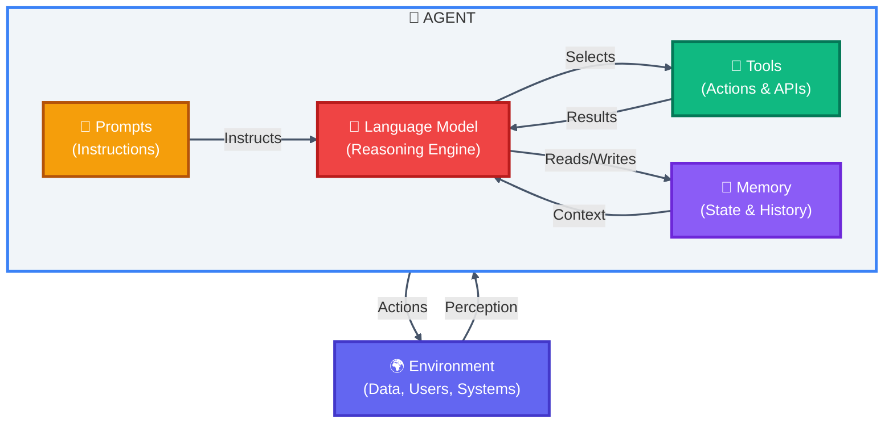
```mermaid
graph TB
    subgraph AGENT["🤖 AGENT"]
        LLM["🧠 Language Model\n(Reasoning Engine)"]
        Tools["🔧 Tools\n(Actions & APIs)"]
        Memory["💾 Memory\n(State & History)"]
        Prompt["📝 Prompts\n(Instructions)"]
    end

    ENV["🌍 Environment\n(Data, Users, Systems)"] -->|"Perception"| AGENT
    AGENT -->|"Actions"| ENV
    Prompt -->|"Instructs"| LLM
    LLM -->|"Selects"| Tools
    LLM -->|"Reads/Writes"| Memory
    Tools -->|"Results"| LLM
    Memory -->|"Context"| LLM

    style LLM fill:#EF4444,stroke:#B91C1C,color:#fff,stroke-width:3px
    style Tools fill:#10B981,stroke:#047857,color:#fff,stroke-width:3px
    style Memory fill:#8B5CF6,stroke:#6D28D9,color:#fff,stroke-width:3px
    style Prompt fill:#F59E0B,stroke:#B45309,color:#fff,stroke-width:3px
    style ENV fill:#6366F1,stroke:#4338CA,color:#fff,stroke-width:3px
    style AGENT fill:#F1F5F9,stroke:#3B82F6,stroke-width:3px

    linkStyle default stroke:#475569,stroke-width:2px
```
*Figure: anatomy of an agent — LLM, tools, memory, and prompts interacting with the environment*


*Figure: agent capability ladder — scope to the lowest rung that solves the problem*


### Language Model (LLM)

The LLM is the cognitive core of an agent. It processes natural language input and generates inferences. The instruction that gives data and direction to the LLM is called a prompt. At the same time, LLMs are trained on world data. This inherent information plus the prompt and the internal mathematical techniques that go into creating the LLM produce the effect of interpretation, inference, and reasoning. This effect of interpretation, inference, and reasoning is what makes LLMs popular and enables the whole Agentic phenomenon! [A Survey of Reasoning with Foundation Models](https://arxiv.org/pdf/2312.11562).
In this course, we use **local LLMs via Ollama** to avoid cloud dependencies. Most of the code demos show only the name of the LLM/URL when calls are made to it. However, LLMs also give us a few more parameters to tweak that can affect its outcome. Settings like top_p, top_k, and temperature help us control the randomness and sampling of the processing. There are more flags like reasoning effort, streaming, and verbosity that a given LLM might support; developers should read the documentation before moving to production.
For most use cases, these are not things we tweak daily in our code. In some cases, one can adjust the context length and the depth of reasoning. It is recommended to read the documentation of your LLM model to understand these settings. However, given the way LLM models and agentic use cases are evolving, we are good with the defaults for all practical purposes.


```mermaid
graph LR
    Input["📝 Input\nPrompt"] --> Tokenize["🔤 Tokenize"]
    Tokenize --> Encode["🔢 Encode\nEmbeddings"]
    Encode --> Attend["🧠 Multi-Head\nAttention"]
    Attend --> Decode["📊 Decode\nProbabilities"]
    Decode --> Sample["🎲 Sample\n(temp, top_p)"]
    Sample --> Output["✅ Output\nTokens"]

    style Input fill:#6366F1,stroke:#4338CA,color:#fff,stroke-width:3px
    style Tokenize fill:#3B82F6,stroke:#1E40AF,color:#fff,stroke-width:3px
    style Encode fill:#8B5CF6,stroke:#6D28D9,color:#fff,stroke-width:3px
    style Attend fill:#EF4444,stroke:#B91C1C,color:#fff,stroke-width:3px
    style Decode fill:#F59E0B,stroke:#B45309,color:#fff,stroke-width:3px
    style Sample fill:#EC4899,stroke:#BE185D,color:#fff,stroke-width:3px
    style Output fill:#10B981,stroke:#047857,color:#fff,stroke-width:3px

    linkStyle default stroke:#475569,stroke-width:2px
```
*Figure: LLM request-response lifecycle — tokenize, encode, attend, decode, sample*


#### Prompt Engineering

Prompts are instructions to the LLM that shape its behavior. Prompt also significantly shapes the outcome in terms of the result as well as the format. In fact it is the prompt that actually causes the effect to take place. So, it is very important to master prompt engineering  [Paper](https://arxiv.org/pdf/2510.04618) ) to improve agentic outcomes.
First and foremost, ChatGPT has made many to believe that the chat interactions we have with it are how prompts are/should be. Statements like "English is your new programming language" has also fuelled this nonsense grasp of what prompts need to be. 
When it comes to getting the LLM to produce the effect we want, it is the sum total of one or many sentences with examples and keywords that have to come together as a coherent instruction, agentic or not. Here is a good paper you must read [Can Large Language Models Reason and Plan?](https://arxiv.org/pdf/2403.04121)

**Suggestions to craft good prompts:**
- **Role:** This can include system, user, or assistant. Specifying the system role has an overarching effect. Usually user or assistant roles help us get the effect we want.
- **Task:** Framing the prompt as a task directs the LLM into narrowing down the range of outcomes. However, task is a generic word; it can also be replaced with aim, job, or similar words. The task itself can be to think and reflect, a chain of actions, a review, or mid-conversation instructions for longer tasks.
- **Constraints:** Framing prompts with constraints also narrows down the range of alternatives the LLM has for interpreting and processing the prompt. It goes without saying that synonyms and antonyms of this word can be used; for example, expectations. This can also be a powerful specification for workflow/task-related prompts.
- **Format:** Since we are focused on usage of prompts for agentic processing, specifying the format of input and output helps us with easier processing. One can use standard keywords from the programming world or general English, or even include samples of the format. The prompt itself can be formatted with sections, numbers, or any sort of metadata or meta-program.
- **Give Examples:** Few-shot demonstrations of input-output pairs or the processing help the prompt contextualize the whole thing better and give precise outcomes. The presence or absence of examples has led to terms like zero-shot, one-shot, or many-shot learning. 
(*Most of the suggestions above are about text processing, but they are useful for media processing with some deductive thinking.)
By now, you would have realized that prompts should be seen as giving instructions to an intelligent pre-teenager. All the elements of sentence structure and grammar we learned in high school come into play when using LLMs. One can also leverage experience from one's programming background by using numbering, examples, paired sentences, or even code to create effective prompts. If the prompts are long, they can be chained to get the final outcome. It is worth noting that some design patterns from classic programming might be novel when applied to prompt engineering (a fact that LLM researchers are discovering regularly). This observation applies to using data representations like graphs or time series within prompts.

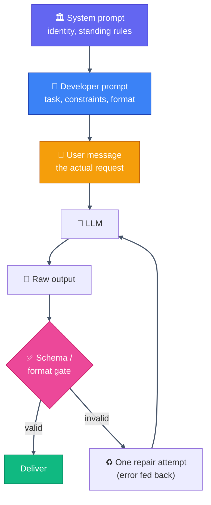
```mermaid
graph TB
    SYS["🏛️ System prompt\nidentity, standing rules"] --> DEV["🔧 Developer prompt\ntask, constraints, format"]
    DEV --> USR["💬 User message\nthe actual request"]
    USR --> LLM["🧠 LLM"]
    LLM --> OUT["📄 Raw output"]
    OUT --> GATE{"✅ Schema /\nformat gate"}
    GATE -->|valid| DONE["Deliver"]
    GATE -->|invalid| REPAIR["♻️ One repair attempt\n(error fed back)"]
    REPAIR --> LLM

    style SYS fill:#6366F1,stroke:#4338CA,color:#fff
    style DEV fill:#3B82F6,stroke:#1E40AF,color:#fff
    style USR fill:#F59E0B,stroke:#B45309,color:#fff
    style GATE fill:#EC4899,stroke:#BE185D,color:#fff
    style DONE fill:#10B981,stroke:#047857,color:#fff
    linkStyle default stroke:#475569,stroke-width:2px
```
*Figure: the prompt is a layered contract — instructions stack from durable (system) to transient (user), and the output earns trust only by passing the gate; when it fails, repair with the error in context rather than blind retry*


Here is a succinct sample of a prompt from OpenAI
```
<personality_and_writing_controls>
- Persona: <one sentence>
- Channel: <Slack | email | memo | PRD | blog>
- Emotional register: <direct/calm/energized/etc.> + "not <overdo this>"
- Formatting: <ban bullets/headers/markdown if you want prose>
- Length: <hard limit, e.g. <=150 words or 3-5 sentences>
- Default follow-through: if the request is clear and low-risk, proceed without asking permission.
</personality_and_writing_controls>
<structured_output_contract>
- Output only the requested format.
- Do not add prose or markdown fences unless they were requested.
- Validate that parentheses and brackets are balanced.
- Do not invent tables or fields.
- If required schema information is missing, ask for it or return an explicit error object.
</structured_output_contract>
```

Inquisitive readers might read these papers : 
[PROMPT DESIGN AND ENGINEERING: INTRODUCTION AND
ADVANCED METHODS](https://arxiv.org/pdf/2401.14423) 
[The Prompt Report: A Systematic Survey of Prompt Engineering
Techniques](https://arxiv.org/pdf/2406.06608),
([[Paper1 ](https://arxiv.org/pdf/2109.01652)], [Paper2](https://arxiv.org/pdf/2005.14165) ,[Paper3](https://arxiv.org/pdf/2201.11903) ,[Paper4](https://arxiv.org/pdf/2210.03493) ,[Paper5](https://arxiv.org/pdf/2311.11482),[Paper5](https://arxiv.org/pdf/2110.08387)[Paper6 ](https://arxiv.org/pdf/2305.10601),[Paper7](https://arxiv.org/pdf/2305.08291))

There is a danger that the discourse above might look like generic vague guidance on formatting prompts. It will help students learn how the multi-head attention and mixture-of-expert architecture of LLMs came into being for a nuanced understanding of why prompts work in the first place.

Context Engineering is a natural conceptual evolution of prompt engineering when we realize that our LLM interactions have become lengthier and more complex with the advent of Agentic AI. The context available to the agent for the whole lifecycle might be different from what a sub-agent or a particular tool might have, which might be different from the context the actual call to the LLM has. While it has lots of parallels to how web programmers managed sessions on the server or browser side, context and memory for LLMs are closer to a ledger or running log concept than a session/database concept.

Lastly: LLMs are billed per token! The balance between verbose and precise is where your career as a context engineer lies :)

**TODO (expand here):**
- [ ] Structured outputs as response contracts (strict schema, validation failures, repair loop)


#### Tool Calling (Function Calling)

The term Agentic AI came into popularity when it was discovered that LLMs can be supplemented with function calls. These function calls, now called tools, allowed retrieval of data that is not available within the LLM. It also allowed concrete business actions to happen, thereby achieving agentic results.
Typically, tools are functions that can perform some action locally or internally call other systems. These can be file systems, web services, databases, or anything else we might otherwise invoke. 

**Typical tool calling:**
1. Define tools with JSON schemas
2. Send schemas to LLM along with user query
3. LLM returns `{"tool": "name", "args": {...}}`
4. Agent executes tool and returns result
5. LLM incorporates result into reasoning

However, it must be noted that tools with LLMs go beyond typical handler-mapping or command pattern paradigms. The ability of LLMs to reflect on the input or about the set of actions it needs to take gives us the effect of selecting the appropriate tool from a set of available tools. It can then be made to sequence tools, understand its input-output-errors, and so on. This has led us to use tools and agents as workflow orchestrators with reasoning, adaptability, and some sort of autonomous decision-making (a second-order effect of reasoning). This is further enhanced by adding routine framework capabilities like sequencing, memory, authentication, monitoring, visual modeling, and additional high-level abstractions.
The reasoning capability of LLMs is the centerpiece of the agentic AI movement. It is also the key differentiator between Agentic AI and workflow management systems from earlier generations. Another thing to note is that LLMs are multimodal and multilingual, which can greatly enhance the field utility of agentic deployment. 
 


**Tool design principles:**
- Tools must have clear, unambiguous specifications  including its purpose,descriptions,arguments
- Tools should utilize different prompt contexts like tool,system to achieve both differentiation and functional cohesiveness  
- Tools should utilize different memory types for state privacy as well as state transitions.
- Tool outputs should be deterministic and observable
- To the extent possible tools should be composable and parallelizable
- Tools should aim to minimize format transformation 
- Tools should fail gracefully with informative error messages
- Tools should have clear access patterns and use principle of least privilege.
- Tools should avoid creating irreversible state changes (or offer ability to reverse/clean up) (this is better handled at agent level)
- Tools should implement sufficient monitoring for debugging as well as optimization purpose. 

**Example flow:**

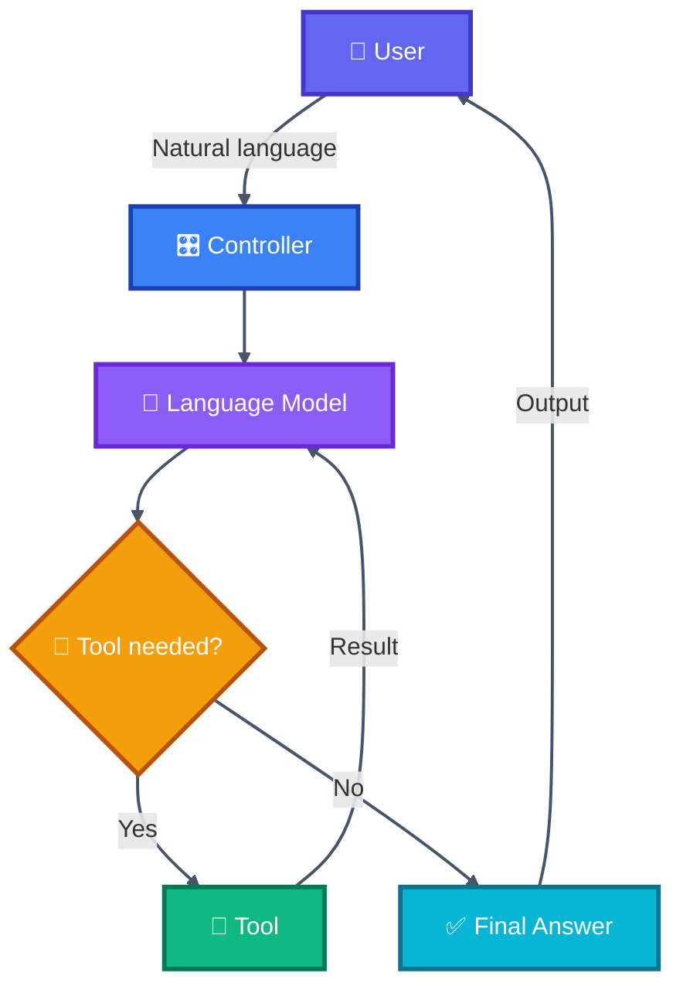
```mermaid
graph TD
    User["👤 User"] -->|"Natural language"| Controller["🎛️ Controller"]
    Controller --> LLM["🧠 Language Model"]
    LLM --> Decision{"🔀 Tool needed?"}
    Decision -->|"Yes"| Tool["🔧 Tool"]
    Tool -->|"Result"| LLM
    Decision -->|"No"| Answer["✅ Final Answer"]
    Answer -->|"Output"| User

    style User fill:#6366F1,stroke:#4338CA,color:#fff,stroke-width:3px
    style Controller fill:#3B82F6,stroke:#1E40AF,color:#fff,stroke-width:3px
    style LLM fill:#8B5CF6,stroke:#6D28D9,color:#fff,stroke-width:3px
    style Decision fill:#F59E0B,stroke:#B45309,color:#fff,stroke-width:3px
    style Tool fill:#10B981,stroke:#047857,color:#fff,stroke-width:3px
    style Answer fill:#06B6D4,stroke:#0E7490,color:#fff,stroke-width:3px

    linkStyle default stroke:#475569,stroke-width:2px
```
*Figure: agent controller–LLM–tool decision loop*

Traditionally a tool can be defined like to code snippet below. Together with the actual function definition it can be used by LLMs to invoke the tool on need.
```
    {
        "type": "function",
        "name": "Name_of_tool",
        "description": "Desc of the tool",
        "parameters": {
            "type": "object",
            "properties": {
                "prop1": {
                    "type": "string",
                    "description": "Description of the field",
                },
            },
            "required": ["prop"],
        },
    },
```
These tool definitions are supplied to the LLM chat object.
However with the addition of MCP-based remote tools, web search, shell commands, and operating system-based tools/skills, there is now a wider choice of tools for our LLM to use. Most of these are specified via the tools keyword; the dictionary specification for each of them will be a descriptive JSON (including auth tokens). This is an evolving field so please always check with documentation from your LLM provider for the supported tool types and related syntax.
Here is an OpenAI-compatible tool specification like this:
```
  "tool_choice": {
    "type": "allowed_tools",
    "mode": "auto",
    "tools": [
      { "type": "function", "name": "get_weather" },
      { "type": "function", "name": "search_docs" }
    ]
  }

```
As a developer working on agents, it is useful to use higher-order abstractions offered by SDKs and frameworks. LangChain, for example, offers a neat @tool annotation that simplifies the lengthy JSON-based tool specification for us.

```
@tool
def get_weather(city):
    """Simple HTTP call to a public weather service
    
    Args:
        city (str): The city to get the weather for.
        
    Returns:
        str: The weather for the given city.
    """
```

**TODO (expand here):**
- [ ] Worked recovery trace (one printed Observe→Reason→Decide→Act→Reflect cycle from [`code/module01_raw/1.11_ota_loop_from_scratch.py`](code/module01_raw/1.11_ota_loop_from_scratch.py) with deliberate fault injection)
---

# Foundation of Agentic AI

Most of the LLMs today are deployed as web endpoints. It is technically possible to invoke them as method calls. However, production-grade models end up needing specialized processors and memory to give faster results with longer context windows. So web service calls it is. By now we have made it clear that LLMs are fed with the context that includes the user's ask, different prompt fragments, and detailed tool definitions. It must also be clear that given a user's query, the LLM has to decide if it can reply with its embedded information or needs assistance from a tool. While the decision lies with LLMs, the execution of the tool lies outside it. That outside is either raw/basic code or some curated abstraction that makes life easy for developers. Post-execution, the tool response (i.e., observation) is passed back to the LLM for final response generation. This is also a good place to emphasize that the LLM has indirect contextual awareness of the tools in effect. It is also important to remember that detailed and unique tool definitions and descriptions help.

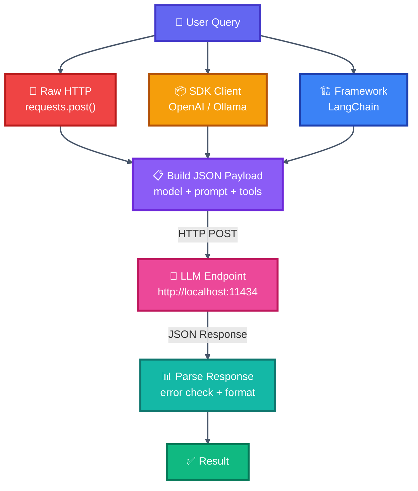
```mermaid
graph TD
    U["👤 User Query"] --> Raw["🔧 Raw HTTP\nrequests.post()"]
    U --> SDK["📦 SDK Client\nOpenAI / Ollama"]
    U --> FW["🏗️ Framework\nLangChain"]

    Raw --> Payload["📋 Build JSON Payload\nmodel + prompt + tools"]
    SDK --> Payload
    FW --> Payload

    Payload -->|"HTTP POST"| LLM["🧠 LLM Endpoint\nhttp://localhost:11434"]
    LLM -->|"JSON Response"| Parse["📊 Parse Response\nerror check + format"]
    Parse --> Result["✅ Result"]

    style U fill:#6366F1,stroke:#4338CA,color:#fff,stroke-width:3px
    style Raw fill:#EF4444,stroke:#B91C1C,color:#fff,stroke-width:3px
    style SDK fill:#F59E0B,stroke:#B45309,color:#fff,stroke-width:3px
    style FW fill:#3B82F6,stroke:#1E40AF,color:#fff,stroke-width:3px
    style Payload fill:#8B5CF6,stroke:#6D28D9,color:#fff,stroke-width:3px
    style LLM fill:#EC4899,stroke:#BE185D,color:#fff,stroke-width:3px
    style Parse fill:#14B8A6,stroke:#0F766E,color:#fff,stroke-width:3px
    style Result fill:#10B981,stroke:#047857,color:#fff,stroke-width:3px

    linkStyle default stroke:#475569,stroke-width:2px
```
*Figure: three ways to call an LLM — raw HTTP, SDK client, or framework abstraction*

Making a call to an LLM is a typical HTTP request-response invocation. 
```
url = "http:// "
prompt = "What is the capital of France?"
payload = {
    "model": "llama3",  # Default model
    "prompt": prompt,
    "stream": False
}
response = requests.post(url, json=payload)
print(response.json().get("response", ""))
```
However, one has to now write boilerplate code for error checking and formatting. The response object from the LLM is actually a very lengthy JSON with lots of information (try and see it) which we don't need for most of our calls. Moreover, the interactions with the LLM might be a multi-turn chat-like conversation or it might be a streaming response. In such cases, using the client objects provided by LLM SDK or framework providers helps us save time. Here is sample from OpenAI:

```
stream = client.responses.create(
    model="gpt-5",
    input=[
        {
            "role": "user",
            "content": "What is the capital of France",
        },
    ],
    stream=True,
)

```
Read the SDK documentation fully to know all the levers and knobs available to you.


### Retrieval-Augmented Generation (RAG)

RAG stands literally for what it does. There are many cases where LLMs do not have information about your local knowledge base, but we wish to use LLMs to supplement how that local knowledge is presented. So we use LLM-based generation of information augmented by information retrieved from your knowledge base. There are cases where post-training LLMs might allow us to embed such knowledge into LLMs, but there are also cases where this is technology overkill. So RAG uses the power of tool calling to get knowledge from your knowledge base and pass it to the LLM with a prompt to generate an enhanced response. In essence, it is nothing different from other tool calls you have seen. However, the topics of knowledge representation and accurate retrieval are ages old. Most of the RAG-related skills you will learn are information search and retrieval relevance skills. 

**Basic RAG flow:**
(If you have been working with databases and using index and select queries with wildcards, you have already entered the search-retrieval arena. If you have experience with Unix pipes, sed, awk, or have used regex in your code, you know the direction well.)


```mermaid
graph LR
    Q["🔍 Question"] --> E["🔢 Embed\nQuery"]
    E --> VS[("🗄️ Vector\nStore")]
    VS --> C["📋 Top-k\nContext"]
    C --> P["📝 Prompt"]
    P --> L["🧠 LLM"]
    L --> R["✅ Response"]

    style Q fill:#6366F1,stroke:#4338CA,color:#fff,stroke-width:3px
    style E fill:#8B5CF6,stroke:#6D28D9,color:#fff,stroke-width:3px
    style VS fill:#3B82F6,stroke:#1E40AF,color:#fff,stroke-width:3px
    style C fill:#14B8A6,stroke:#0F766E,color:#fff,stroke-width:3px
    style P fill:#F59E0B,stroke:#B45309,color:#fff,stroke-width:3px
    style L fill:#EF4444,stroke:#B91C1C,color:#fff,stroke-width:3px
    style R fill:#10B981,stroke:#047857,color:#fff,stroke-width:3px

    linkStyle default stroke:#475569,stroke-width:2px
```
*Figure: simplified RAG architecture — question, embed, retrieve, prompt, generate*

In its simple form, the knowledge base might reside in a structured database, in which basic DB-level ingestion and search might be enough to fulfill your RAG requirements. If you can reduce your knowledge base to this paradigm, life is easy.
However, based on document format alone, your knowledge base might be stored in Word documents, PowerPoint presentations, PDFs, Excel files, XMLs, code files, web pages, or even structured files like DITA or Markdown. Moreover, the context in these files might itself be simple text, diagrams, charts, tables, or media files. So we have a dual responsibility: parsing the documents at the technology level and making sense of them semantically.


Traditionally building document reverse index on these documents sufficed. Earlier versions of Apache's solr/lucene or opensearch/Elasticsearch or even your application log dashboards worked just fine. However when the knowledge base is bigger and the knowledge representation has overlap simple approaches like keyword match or keyword density might not score high on relevancy/accuracy. At the same time freshness of the index is another aspect one has to take care of. And then there can always be newer version of the same document where some metadata based upranking might be needed.
Keyword based searches however might not do well when the user might use different synonyms of the standard terms. Vector comparison approaches like cosine similarity (or alternative) can deliver more relevant results. It is also possible to mix multiple approaches like index with vector based similarity and semantic meta model to give better results. Domains like legal or pharma are the places where such heavyweight requirements exist. Point is remember that the domain should decide the technology mix and not what developer thinks is geeky cool thing.
Most of the literature on RAG relies on vector based matches. This gives rise to the need to decide on the chunk size, overlap windows and chunking frequency/rechunking and so on. However there are always enterprise tools where all of this ingestion/vectorization can happen out-of-the-box. You might use that rather than handcoding the ingestion pipeline and reinvent the search wheel again after decades of gap. This is big item for interview questions though.

**Explanation of basic RAG **
Chunking: This is a process of breaking the document into chunks for vectorized ingestion. This chunk size and chunk overlap window depend on the model you are using as well as the nature of your documents. BAAI/BGE or OpenAI embedding models are good defaults as of this writing. In specialized domains, you might want to fine-tune these models to suit your specific needs. However, in such a case, you might need to process the user's original query so that it benefits from the tuned embedding.

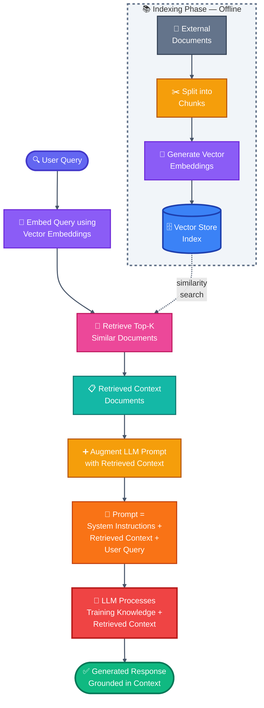
```mermaid
flowchart TD
    Start(["🔍 User Query"]) --> Embed["🔢 Embed Query using\nVector Embeddings"]
    
    subgraph Indexing["📚 Indexing Phase — Offline"]
        Docs["📄 External\nDocuments"] --> Split["✂️ Split into\nChunks"]
        Split --> VecEmbed["🔢 Generate Vector\nEmbeddings"]
        VecEmbed --> Store[("🗄️ Vector Store\nIndex")]
    end
    
    Embed --> Retrieve["🎯 Retrieve Top-K\nSimilar Documents"]
    Store -.->|"similarity\nsearch"| Retrieve
    
    Retrieve --> Context["📋 Retrieved Context\nDocuments"]
    
    Context --> Augment["➕ Augment LLM Prompt\nwith Retrieved Context"]
    
    Augment --> Prompt["📝 Prompt =\nSystem Instructions +\nRetrieved Context +\nUser Query"]
    
    Prompt --> LLM["🧠 LLM Processes\nTraining Knowledge +\nRetrieved Context"]
    
    LLM --> Response(["✅ Generated Response\nGrounded in Context"])
    
    style Start fill:#6366F1,stroke:#4338CA,color:#fff,stroke-width:3px
    style Embed fill:#8B5CF6,stroke:#6D28D9,color:#fff,stroke-width:2px
    style Docs fill:#64748B,stroke:#334155,color:#fff,stroke-width:2px
    style Split fill:#F59E0B,stroke:#B45309,color:#fff,stroke-width:2px
    style VecEmbed fill:#8B5CF6,stroke:#6D28D9,color:#fff,stroke-width:2px
    style Store fill:#3B82F6,stroke:#1E40AF,color:#fff,stroke-width:3px
    style Retrieve fill:#EC4899,stroke:#BE185D,color:#fff,stroke-width:2px
    style Context fill:#14B8A6,stroke:#0F766E,color:#fff,stroke-width:2px
    style Augment fill:#F59E0B,stroke:#B45309,color:#fff,stroke-width:2px
    style Prompt fill:#F97316,stroke:#C2410C,color:#fff,stroke-width:2px
    style LLM fill:#EF4444,stroke:#B91C1C,color:#fff,stroke-width:3px
    style Response fill:#10B981,stroke:#047857,color:#fff,stroke-width:3px
    style Indexing fill:#F1F5F9,stroke:#64748B,stroke-width:3px,stroke-dasharray:5 5

    linkStyle default stroke:#475569,stroke-width:2px
```
*Figure: retrieval-augmented generation (RAG) pipeline — indexing, retrieval, and generation phases*

### Advanced RAG
Moving beyond tutorials to production systems, one can use sophisticated models for embedding and retrieval. It is also possible to add more semantic refinement at the retrieval level or even use an LLM to judge the relevance before presenting results to the user.
At the same time, LLMs with larger context windows might also eliminate many redundancy, staleness, and duplication problems.

However, the main issue to solve for RAG is when multiple correct knowledge bases with implied relationships exist. A good example is the legal domain, where a client's ongoing case, relevant case judgments, and legal codes of the country are all independent knowledge bases that must be applied together to help the lawyer fulfill their case strategy. This is a place where a linear RAG pipeline isn't useful. One needs to use traditional software design patterns to pre/post-process or use multi-stage/source retrieval/augmentation before generating a final and useful result. Query rewriting, retrieval reranking, and chain of knowledge are good examples of traditional design techniques applied well to RAG. It is also important to note that evaluating RAG systems goes beyond result matching. Numerical measures like speed, relevance, accuracy, recency, and domain-specific measures like citation index must be applied. We have not included multimodal RAG directly here, but the discourse is wide enough to help you.

Agentic RAG with reasoning and review capability. PageRank reincarnations.

**TODO (expand here):**
- [ ] Semantic caching (difference from prompt caching, threshold tuning, cache invalidation risk)

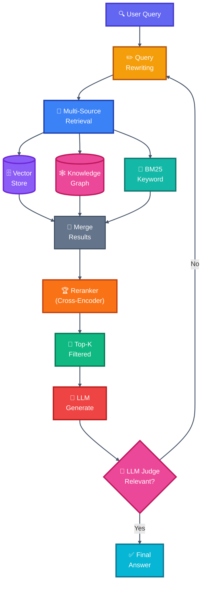
```mermaid
graph TD
    Q["🔍 User Query"] --> QR["✏️ Query\nRewriting"]
    QR --> Multi["🔀 Multi-Source\nRetrieval"]

    Multi --> VS1[("🗄️ Vector\nStore")]
    Multi --> KG[("🕸️ Knowledge\nGraph")]
    Multi --> BM["📑 BM25\nKeyword"]

    VS1 --> Merge["🔗 Merge\nResults"]
    KG --> Merge
    BM --> Merge

    Merge --> Rerank["🏆 Reranker\n(Cross-Encoder)"]
    Rerank --> Filter["🎯 Top-K\nFiltered"]
    Filter --> LLM["🧠 LLM\nGenerate"]
    LLM --> Judge{"🧐 LLM Judge\nRelevant?"}
    Judge -->|"Yes"| Answer["✅ Final\nAnswer"]
    Judge -->|"No"| QR

    style Q fill:#6366F1,stroke:#4338CA,color:#fff,stroke-width:3px
    style QR fill:#F59E0B,stroke:#B45309,color:#fff,stroke-width:3px
    style Multi fill:#3B82F6,stroke:#1E40AF,color:#fff,stroke-width:3px
    style VS1 fill:#8B5CF6,stroke:#6D28D9,color:#fff,stroke-width:3px
    style KG fill:#EC4899,stroke:#BE185D,color:#fff,stroke-width:3px
    style BM fill:#14B8A6,stroke:#0F766E,color:#fff,stroke-width:3px
    style Merge fill:#64748B,stroke:#334155,color:#fff,stroke-width:2px
    style Rerank fill:#F97316,stroke:#C2410C,color:#fff,stroke-width:3px
    style Filter fill:#10B981,stroke:#047857,color:#fff,stroke-width:3px
    style LLM fill:#EF4444,stroke:#B91C1C,color:#fff,stroke-width:3px
    style Judge fill:#EC4899,stroke:#BE185D,color:#fff,stroke-width:3px
    style Answer fill:#06B6D4,stroke:#0E7490,color:#fff,stroke-width:3px

    linkStyle default stroke:#475569,stroke-width:2px
```
*Figure: advanced RAG — query rewriting, multi-source retrieval, reranking, and LLM-as-judge loop*

[RAG Comparison Paper, must read](https://arxiv.org/pdf/2312.10997)


*Figure: the three RAG paradigms — naive retrieves once and hopes; advanced keeps the same spine but optimises before and after retrieval; modular breaks the pipeline into swappable parts and lets the flow loop. Redrawn from the three-paradigm taxonomy in Gao et al., ["Retrieval-Augmented Generation for Large Language Models: A Survey"](https://arxiv.org/abs/2312.10997); the framing is theirs, this drawing is not a reproduction of their figure.*

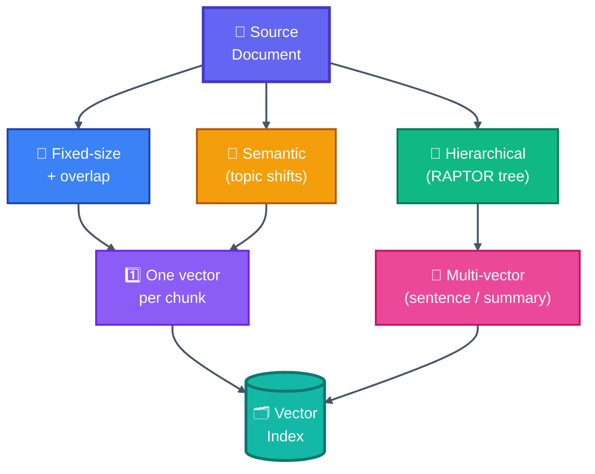
```mermaid
graph TD
    DOC["📄 Source\nDocument"] --> FIX["📏 Fixed-size\n+ overlap"]
    DOC --> SEM["🧩 Semantic\n(topic shifts)"]
    DOC --> HIER["🌳 Hierarchical\n(RAPTOR tree)"]

    FIX --> ONE["1️⃣ One vector\nper chunk"]
    SEM --> ONE
    HIER --> MULTI["🔢 Multi-vector\n(sentence / summary)"]

    ONE --> IDX[("🗂️ Vector\nIndex")]
    MULTI --> IDX

    style DOC fill:#6366F1,stroke:#4338CA,color:#fff,stroke-width:3px
    style FIX fill:#3B82F6,stroke:#1E40AF,color:#fff,stroke-width:2px
    style SEM fill:#F59E0B,stroke:#B45309,color:#fff,stroke-width:2px
    style HIER fill:#10B981,stroke:#047857,color:#fff,stroke-width:2px
    style ONE fill:#8B5CF6,stroke:#6D28D9,color:#fff,stroke-width:2px
    style MULTI fill:#EC4899,stroke:#BE185D,color:#fff,stroke-width:2px
    style IDX fill:#14B8A6,stroke:#0F766E,color:#fff,stroke-width:3px
    linkStyle default stroke:#475569,stroke-width:2px
```
*Figure: chunking strategies and the one-vs-multi-vector tradeoff*



*Figure: two-stage retrieval — fast bi-encoder recall, accurate cross-encoder rerank*


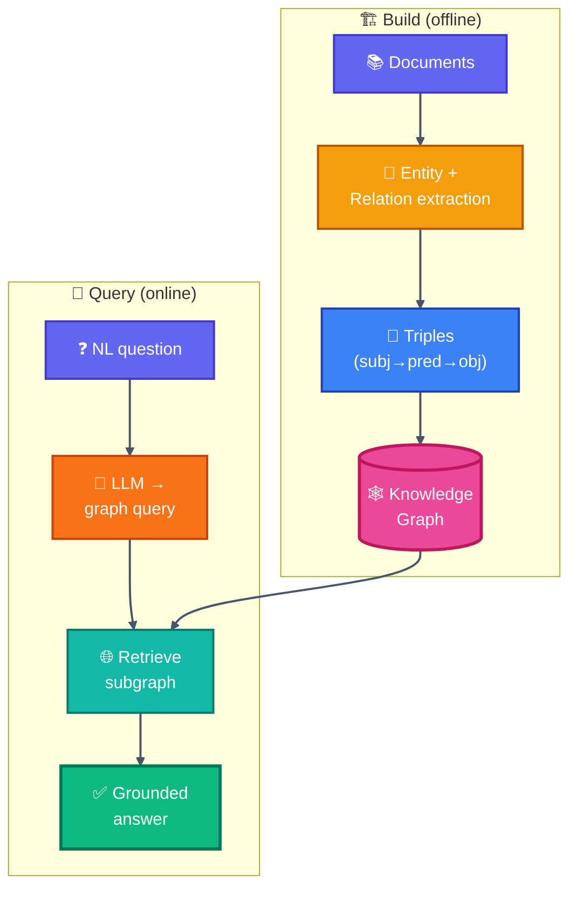
```mermaid
graph TD
    subgraph BUILD["🏗️ Build (offline)"]
        SRC["📚 Documents"] --> EXT["🔬 Entity +\nRelation extraction"]
        EXT --> TRIP["🔗 Triples\n(subj→pred→obj)"]
        TRIP --> KGDB[("🕸️ Knowledge\nGraph")]
    end
    subgraph QUERY["🔎 Query (online)"]
        NLQ["❓ NL question"] --> CYPH["🧠 LLM →\ngraph query"]
        CYPH --> SUB["🌐 Retrieve\nsubgraph"]
        KGDB --> SUB
        SUB --> GEN["✅ Grounded\nanswer"]
    end

    style SRC fill:#6366F1,stroke:#4338CA,color:#fff,stroke-width:2px
    style EXT fill:#F59E0B,stroke:#B45309,color:#fff,stroke-width:2px
    style TRIP fill:#3B82F6,stroke:#1E40AF,color:#fff,stroke-width:2px
    style KGDB fill:#EC4899,stroke:#BE185D,color:#fff,stroke-width:3px
    style NLQ fill:#6366F1,stroke:#4338CA,color:#fff,stroke-width:2px
    style CYPH fill:#F97316,stroke:#C2410C,color:#fff,stroke-width:2px
    style SUB fill:#14B8A6,stroke:#0F766E,color:#fff,stroke-width:2px
    style GEN fill:#10B981,stroke:#047857,color:#fff,stroke-width:3px
    linkStyle default stroke:#475569,stroke-width:2px
```
*Figure: GraphRAG — build a knowledge graph offline, traverse it at query time for multi-hop and global questions*


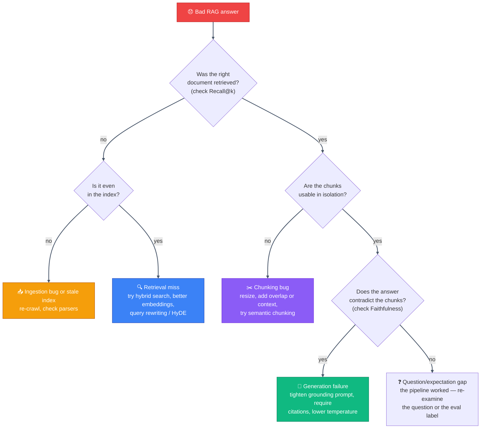
```mermaid
graph TB
    BAD["😞 Bad RAG answer"] --> Q1{"Was the right\ndocument retrieved?\n(check Recall@k)"}
    Q1 -->|no| Q2{"Is it even\nin the index?"}
    Q2 -->|no| FIX1["📥 Ingestion bug or stale index\nre-crawl, check parsers"]
    Q2 -->|yes| FIX2["🔍 Retrieval miss\ntry hybrid search, better embeddings,\nquery rewriting / HyDE"]
    Q1 -->|yes| Q3{"Are the chunks\nusable in isolation?"}
    Q3 -->|no| FIX3["✂️ Chunking bug\nresize, add overlap or context,\ntry semantic chunking"]
    Q3 -->|yes| Q4{"Does the answer\ncontradict the chunks?\n(check Faithfulness)"}
    Q4 -->|yes| FIX4["🤖 Generation failure\ntighten grounding prompt, require\ncitations, lower temperature"]
    Q4 -->|no| FIX5["❓ Question/expectation gap\nthe pipeline worked — re-examine\nthe question or the eval label"]

    style BAD fill:#EF4444,stroke:#B91C1C,color:#fff
    style FIX1 fill:#F59E0B,stroke:#B45309,color:#fff
    style FIX2 fill:#3B82F6,stroke:#1E40AF,color:#fff
    style FIX3 fill:#8B5CF6,stroke:#6D28D9,color:#fff
    style FIX4 fill:#10B981,stroke:#047857,color:#fff
    linkStyle default stroke:#475569,stroke-width:2px
```
*Figure: RAG troubleshooting — walk the tree top-down; each branch is a different root cause with a different cheap fix, and the metrics in the vocabulary above tell you which branch you are on*


 

 


---

# Agentic Execution and Patterns

So far, we have understood that LLMs coupled with prompts and tools can be used to conduct real-world tasks with reasoning/planning. However, the definition of tool we have used sticks to it being a function call. When it comes to orchestrating multi-step complex workflows that might need context management and planning, we need a higher-level abstraction. Such abstractions are built on top of the basic primitives introduced so far, but they allow us more control and elegance while executing agentic flows.
There are multiple frameworks like LangChain, CrewAI, and Java-based Embabel that offer similar abstractions via their frameworks. DSPy from Stanford also offers a novel approach. Most LLM providers like SarvamAI, OpenAI, Anthropic, Google, and DeepSeek also provide such frameworks. We will try to use generic terminology in our explanation but use LangChain as the basis for our discussion.


### An Agent
Agent can be defined as software components that can accomplish real world business tasks and flows in totality. While they can be assisted by LLM reasoning, prompts and tools, the highlight is on real world business tasks and totality.Here is a good guide from Anthropic [Building Effective Agents](https://www.anthropic.com/engineering/building-effective-agents)

### The Agent Loop
  

The fundamental operation of an agentic system follows a **controller-LLM-tool loop**:

1. **Observe:** The agent receives a user query or observes the current state
2. **Reason:** The LLM processes available information and determines the next action
3. **Decide:** The LLM outputs a decision encoded in a structured format (e.g., JSON)
4. **Act:** The agent executes the chosen tool or takes an action
5. **Reflect:** The tool's output is fed back to the LLM for further reasoning
6. **Repeat:** Steps 2–5 continue until a final answer is produced

This loop represents **ReAct** (Reason + Act), a mechanism of LLMs. Here, reasoning and action are tightly coupled, allowing the agent to iterate toward a solution. [ReAct](https://arxiv.org/pdf/2210.03629) [Reflection](https://arxiv.org/pdf/2303.11366).


*Figure: minimal agent loop — controller, LLM, tool decision cycle*

ReAct is a natural progression of the Chain of Thought / Tree of Thought approaches discovered by different researchers. The loop of task/thought, action, and observation/review is a self-correcting superpower available to agents/flows. For the *context of our guide*, please note that not all free models are shipped with thinking ability.



*Figure: five agent-loop shapes — trade reasoning depth, latency, and bounded cost*

**TODO (expand here):**
- [ ] Ralph loop baseline (why dumb loop is useful, where it breaks, compare against ReAct)

**Example flow:**

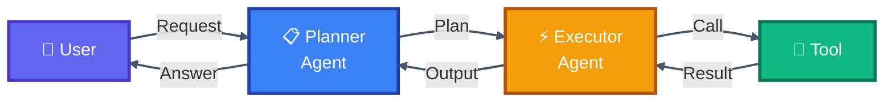
```mermaid
graph LR
    User["👤 User"] -->|"Request"| Planner["📋 Planner\nAgent"]
    Planner -->|"Plan"| Executor["⚡ Executor\nAgent"]
    Executor -->|"Call"| Tool["🔧 Tool"]
    Tool -->|"Result"| Executor
    Executor -->|"Output"| Planner
    Planner -->|"Answer"| User

    style User fill:#6366F1,stroke:#4338CA,color:#fff,stroke-width:3px
    style Planner fill:#3B82F6,stroke:#1E40AF,color:#fff,stroke-width:3px
    style Executor fill:#F59E0B,stroke:#B45309,color:#fff,stroke-width:3px
    style Tool fill:#10B981,stroke:#047857,color:#fff,stroke-width:3px

    linkStyle default stroke:#475569,stroke-width:2px
```
*Figure: ReAct agent loop — plan, execute, observe, repeat*



*Figure: reasoning strategies — CoT (one path), self-consistency (vote over paths), ToT (search over branches), ReWOO (plan-then-execute)*

### Prompt Chaining
In case the processing we are aiming to do is long drawn, it is possible to break it down into multiple steps — prompts such that the next prompt is groomed to process the output of the previous one. In other words, these can be small agents that have specialized processing or grounding via RAG that enriches the payload. Imagining how a compiler processes your code gives you an idea. As such, this is the typical command pattern but called out separately due to its excellent alignment with the token-focused processing that LLMs have.

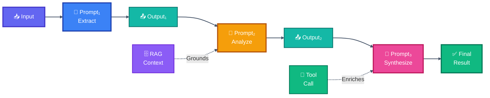
```mermaid
graph LR
    Input["📥 Input"] --> P1["📝 Prompt₁\nExtract"]
    P1 --> O1["📤 Output₁"]
    O1 --> P2["📝 Prompt₂\nAnalyze"]
    P2 --> O2["📤 Output₂"]
    O2 --> P3["📝 Prompt₃\nSynthesize"]
    P3 --> Final["✅ Final\nResult"]

    RAG1["🗄️ RAG\nContext"] -.->|"Grounds"| P2
    Tools1["🔧 Tool\nCall"] -.->|"Enriches"| P3

    style Input fill:#6366F1,stroke:#4338CA,color:#fff,stroke-width:3px
    style P1 fill:#3B82F6,stroke:#1E40AF,color:#fff,stroke-width:3px
    style O1 fill:#14B8A6,stroke:#0F766E,color:#fff,stroke-width:2px
    style P2 fill:#F59E0B,stroke:#B45309,color:#fff,stroke-width:3px
    style O2 fill:#14B8A6,stroke:#0F766E,color:#fff,stroke-width:2px
    style P3 fill:#EC4899,stroke:#BE185D,color:#fff,stroke-width:3px
    style Final fill:#10B981,stroke:#047857,color:#fff,stroke-width:3px
    style RAG1 fill:#8B5CF6,stroke:#6D28D9,color:#fff,stroke-width:2px
    style Tools1 fill:#10B981,stroke:#047857,color:#fff,stroke-width:2px

    linkStyle default stroke:#475569,stroke-width:2px
```
*Figure: prompt chaining — each prompt processes the previous output, optionally grounded by RAG or tools*

### Multi-Agent Patterns

If you have been designing software, you know the principle of specialization already. It goes without saying that if there are two distinct tasks at hand, they should be two distinct agents to begin with.
However, there are times when the task at hand involves many steps that makes the maintenance and debugging of the agent cumbersome. Breaking down such long-drawn tasks into multiple agents helps keep the context cleaner (vis-à-vis prompts, memory, tools). One might even use different models for these agents if justifiable. This gives opportunities to implement different design patterns. In pure technological terms, we can keep sub-agents **sequential** vs **parallel**, **synchronous** vs **asynchronous**.
It also allows us to use traditional [Enterprise Integration Patterns](https://www.enterpriseintegrationpatterns.com/patterns/messaging/toc.html) to great extent. If you hear terms like **master-slave** or **orchestrator-subagent** or **router**/**handoff**, you know that the agentic community is rediscovering past learnings. However, LLM-based processing can give totally novel effects/results with the same old design patterns! Example being the evaluator-optimizer implementation.
 I hope they don't reinvent ESB.
The point to note is that for multi-agent systems or related patterns, one is relying on agentic frameworks wholely.


*Figure: five coordination topologies — where the arrows point is where the bottleneck, the cost, and the failure mode live*


**TODO (expand here):**
- [ ] Mixture of Agents (MoA) pattern (parallel proposers + conservative aggregator)
- [ ] Multi-agent deadlock prevention (hop limits, cycle detection, watchdog timeout)
- [ ] Critic-refiner iterative loop (stop criteria, iteration budget, rubric design)


```mermaid
graph LR
    P["📋 Planner"] --> R["🔍 Researcher"]
    R --> C["🧐 Critic"]
    C --> E["⚡ Executor"]
    E --> O["✅ Output"]

    style P fill:#3B82F6,stroke:#1E40AF,color:#fff,stroke-width:3px
    style R fill:#F59E0B,stroke:#B45309,color:#fff,stroke-width:3px
    style C fill:#EC4899,stroke:#BE185D,color:#fff,stroke-width:3px
    style E fill:#10B981,stroke:#047857,color:#fff,stroke-width:3px
    style O fill:#6366F1,stroke:#4338CA,color:#fff,stroke-width:3px

    linkStyle default stroke:#475569,stroke-width:2px
```
*Figure: multi-agent pipeline — planner, researcher, critic, executor*

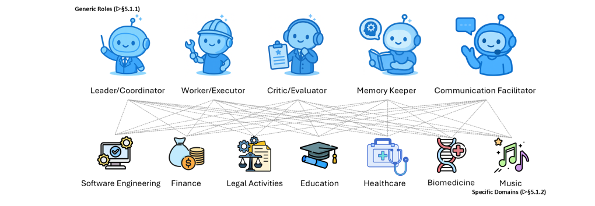
*Figure from Wei et al., "Agentic Reasoning for Large Language Models", [arXiv:2601.12538](https://arxiv.org/abs/2601.12538), licensed [CC BY 4.0](https://creativecommons.org/licenses/by/4.0/).*
A recent paper by [Agentic Reasoning for Large Language Models by Tianxin Wei et. al
](https://arxiv.org/pdf/2601.12538) gives a evolution of Agentic reasoning and new agent roles that are emerging .
It is a good read to get idea on application of agents in diffrent domains . This is one of the important paper to read.
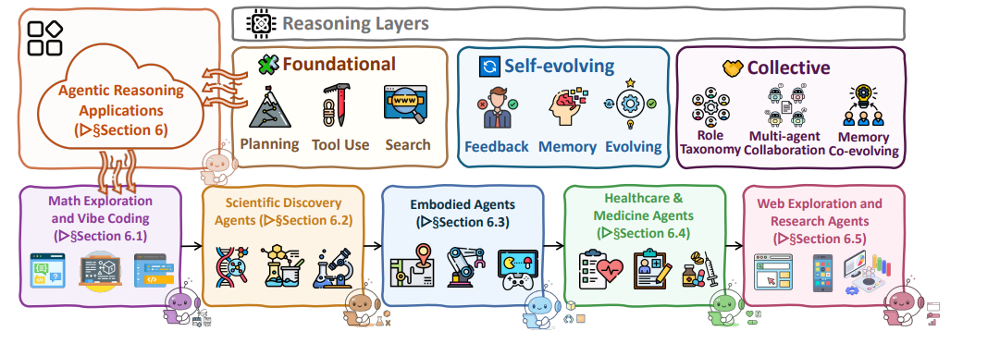
*Figure from Wei et al., "Agentic Reasoning for Large Language Models", [arXiv:2601.12538](https://arxiv.org/abs/2601.12538), licensed [CC BY 4.0](https://creativecommons.org/licenses/by/4.0/).*

### 12 Factors of Agentic Design

12-Factor application design came into practice with the microservices architecture gaining momentum. The central idea was to keep independent services with full autonomy and data context within a single service boundary. It was implied that these services would later contribute to larger functional outcomes via reuse. In similar fashion, Dexter Horthy et al. came up with a 12-factor recommendation for agentic AI: [12-Factor Agents](https://github.com/humanlayer/12-factor-agents/tree/main).



*Figure: 12 factors of agentic design — foundation, state/control, and integration/scale layers*

| # | Factor | Layer |
|---|--------|-------|
| 1 | **Natural Language to Tool Calls** — LLM converts user intent into structured tool invocations | Foundation |
| 2 | **Own Your Prompts** — Keep full control over prompt content and versioning | Foundation |
| 3 | **Own Your Context Window** — Curate what goes into and out of the context deliberately | Foundation |
| 4 | **Tools Are Just Structured Outputs** — Treat tool calls as typed, schema-validated outputs | Foundation |
| 5 | **Unify Execution State & Business State** — Single source of truth for agent + domain state | State & Control |
| 6 | **Launch/Pause/Resume with Simple APIs** — Agents can be paused, persisted, and resumed | State & Control |
| 7 | **Contact Humans with Tool Calls** — Human-in-the-loop via the same tool-call interface | Integration & Scale |
| 8 | **Own Your Control Flow** — Deterministic code decides branching, not the framework | State & Control |
| 9 | **Compact Errors into Context Window** — Fold errors back into context so the agent self-corrects | State & Control |
| 10 | **Small, Focused Agents** — Each agent does one thing well | Integration & Scale |
| 11 | **Trigger from Anywhere** — Agents start from webhooks, crons, UIs, APIs, etc. | Integration & Scale |
| 12 | **Stateless Reducer** — Agent loop is a pure function of (state, event) → new state | Integration & Scale |

**Key Interrelations:**

| From | To | Relationship |
|------|----|-------------|
| F1 (NL → Tool Calls) | F4 (Structured Outputs) | Tool calls **produce** structured outputs |
| F1 (NL → Tool Calls) | F2 (Own Prompts) | Tool-call behavior is **guided by** prompt design |
| F2 (Own Prompts) | F3 (Own Context) | Prompts **shape** what enters the context window |
| F3 (Own Context) | F9 (Compact Errors) | Context window **receives** compacted error feedback |
| F4 (Structured Outputs) | F5 (Unify State) | Structured outputs **drive** state transitions |
| F5 (Unify State) | F6 (Pause/Resume) | Unified state **enables** checkpoint & resume |
| F5 (Unify State) | F12 (Stateless Reducer) | Unified state **enables** the reducer pattern |
| F6 (Pause/Resume) | F7 (Contact Humans) | Pause capability **supports** human-in-the-loop |
| F8 (Own Control Flow) | F9 (Compact Errors) | Control flow **manages** error handling strategy |
| F8 (Own Control Flow) | F10 (Small Agents) | Control flow **scopes** agent responsibilities |
| F10 (Small Agents) | F11 (Trigger Anywhere) | Focused agents are easily **exposed** as triggers |
| F12 (Stateless Reducer) | F6 (Pause/Resume) | Statelessness **simplifies** pause/resume |


### Memory

Anytime we create framework/code to conduct long multi-step processing, we need some mechanisms to store, update, retrieve, and clean state. Agents are no different. However, the implementation and utilization of memory for agents is different from what you would see in web backend frameworks. It's closer to a web frontend framework.

Any interaction with an LLM by default has its own context window and prompt context (i.e., conversation trace). This itself is a good stand-in for in-process memory requirements. A smart approach is to use the conversation trace by structuring it with step/stage numbers/labels, roles vs responses, and timestamps. It is also a good idea to clean, compact, or summarize this trace as conversations grow longer.

Short-term memory:
- Conversation history (all recent messages)
- Typically 10–100 most recent exchanges
- Subject to context window limits
- Your agent framework might implement thread-level or conversation-level memory

Long-term memory: This helps agents with external longer-term state management of interactions. The choices for external storage are no different from what is used for other design paradigms. You can use all kinds of databases, file and storage systems, in-memory structures, and so on. The choice relies entirely on which kind of data representation is needed (e.g., tabular, time-series, key-value, graphs) and what retrieval, search, lookup, store, and storage/availability guarantees are required. It goes without saying that introducing identifiers like interaction_id, agent_id, flow_id, etc., will add robustness to your processing.

The thing to note here is that we are really bridging the gap between the context/ledger-style working of LLMs and storing multiple conversation/agentic calls in a database. While much of this bridging will be governed by your agentic framework, traditional techniques like sliding window, summarization/compaction, and checkpointing are available for us as developers.

At the same time, with the power of vibe-coded agents, personal agents, and deep agents that run in parallel for long durations, we have started using Markdown or other file types (like JSON) for memory-instruction-ledger effects. Here is a quote from a paper called [Reasoning Bank: Scaling Agent Self-Evolving with Reasoning Memory](https://arxiv.org/pdf/2509.25140) that will give you an idea of what this is evolving into: "Instead of reasoning ad-hoc inside a single context window, Deep Agents maintain structured task plans they can update, retry, and recover from. Think of it as a living to-do list that guides the agent toward its long-term goal. To experience this, just try out Claude Code or Codex for planning; the results are significantly better once you enable it before executing any task".

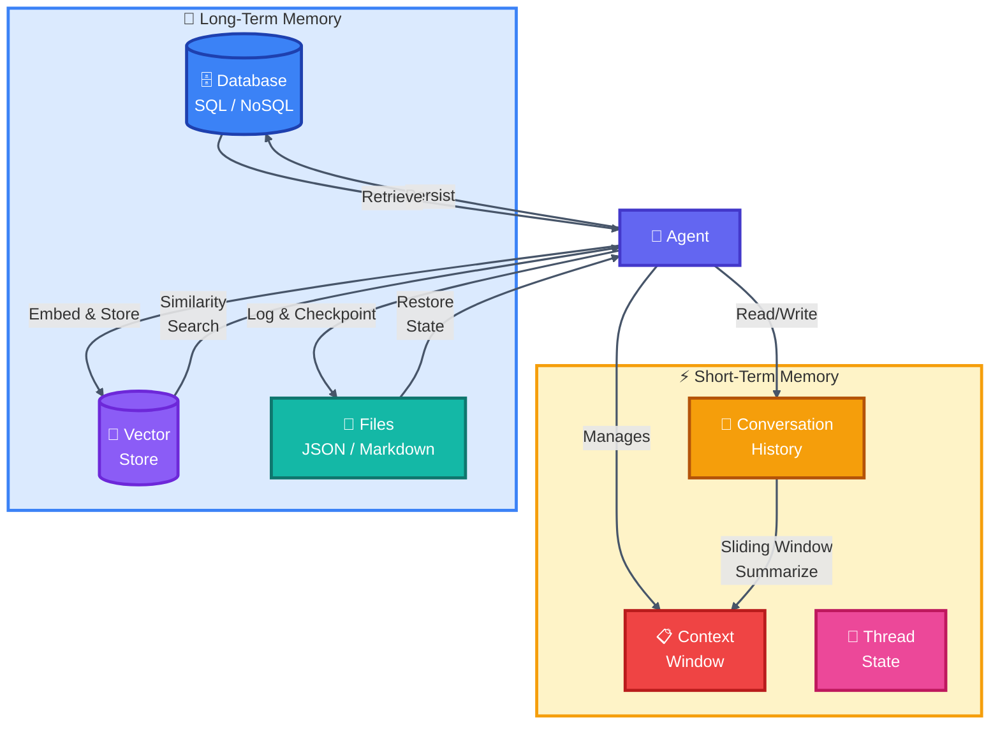
```mermaid
graph TB
    subgraph SHORT["⚡ Short-Term Memory"]
        Conv["💬 Conversation\nHistory"]
        Ctx["📋 Context\nWindow"]
        Thread["🧵 Thread\nState"]
    end

    subgraph LONG["💾 Long-Term Memory"]
        DB[("🗄️ Database\nSQL / NoSQL")]
        VStore[("🔢 Vector\nStore")]
        Files["📁 Files\nJSON / Markdown"]
    end

    Agent["🤖 Agent"] -->|"Read/Write"| Conv
    Agent -->|"Manages"| Ctx
    Conv -->|"Sliding Window\nSummarize"| Ctx

    Agent -->|"Persist"| DB
    Agent -->|"Embed & Store"| VStore
    Agent -->|"Log & Checkpoint"| Files

    DB -->|"Retrieve"| Agent
    VStore -->|"Similarity\nSearch"| Agent
    Files -->|"Restore\nState"| Agent

    style Agent fill:#6366F1,stroke:#4338CA,color:#fff,stroke-width:3px
    style Conv fill:#F59E0B,stroke:#B45309,color:#fff,stroke-width:3px
    style Ctx fill:#EF4444,stroke:#B91C1C,color:#fff,stroke-width:3px
    style Thread fill:#EC4899,stroke:#BE185D,color:#fff,stroke-width:3px
    style DB fill:#3B82F6,stroke:#1E40AF,color:#fff,stroke-width:3px
    style VStore fill:#8B5CF6,stroke:#6D28D9,color:#fff,stroke-width:3px
    style Files fill:#14B8A6,stroke:#0F766E,color:#fff,stroke-width:3px
    style SHORT fill:#FEF3C7,stroke:#F59E0B,stroke-width:3px
    style LONG fill:#DBEAFE,stroke:#3B82F6,stroke-width:3px

    linkStyle default stroke:#475569,stroke-width:2px
```
*Figure: memory architecture — short-term (conversation, context, thread) vs long-term (database, vector store, files)*

### Deep Agents

There are now agents that work on long running tasks often with acess to operating system or other sofware there on .

### LangChain

LangChain is a prominent framework that gives detailed convenience for working with LLMs and creating agents. We have already shown LangChain code in different sections. This section aims to outline its conceptual take on agentic/LLM systems.

By now, you know the basic concepts like LLM, prompt, tool, agent, and memory. You might have also noted the input/output transformation and some sort of logging and guardrails we have implemented. The text that follows assumes this knowledge and your familiarity with working with other frameworks. It's an annotated summary for you.

**Model**: This is their basic wrapper for initializing the object with a specific provider and parameters supported by those LLMs. It allows simple invocation, batch mode, and streaming. It obviously has a method to bind tools. The main benefit of this model object is that it offers the ability to experiment with multiple models and attach them to agents for different design patterns.

**Message**: Message is their wrapper on prompts and chat completion-style prompt-response interaction. Personally, I prefer keeping messages in raw JSON format. There might be benefit to using this wrapper for multimodal interaction or reasoning interactions. This is a necessary abstraction and should evolve as LLMs become more agentic themselves.

**Tools**: This is the most straightforward wrapper representing the tool definition of LLM interaction. The annotation @tool helps us with a clean separation of functions that do actual work from the rest of the agentic code. Just like commands or handlers in web programming, tools have access to other building blocks from LangChain, like memory and messages, allowing some semblance of local state vs agent-level state and separation. It also gives us a nice placeholder for any pre- or post-processing of format or forming task graphs.

**Memory**: AgentState is a neat abstraction to facilitate thread-local state while interactions with LLMs are always full-context in nature. That mandates us to frequently update, trim, and compact the memory via this abstraction. If you have worked with sessions in web applications or, better still, in the Express/Node.js ecosystem, this is very relatable.

**Agent**: Agent is the prime and key abstraction given by LangChain. As per the framework, Agents represent concrete business tasks/objectives. By definition, this means it has access to other objects like Models and Tools. The beauty is that this object allows GoF design patterns to play out. So one can get a feeling of defining models, tools, or prompts at runtime, modifying or selecting them based on some response/flag, injecting intermediate processors for format conversion or error handling, and so on. This is very close to your servlet equivalent in the MVC paradigm. It goes without saying that an Agent abstraction led us to multi-agent systems!

```
agent = create_agent(
    model=basic_model,  # Default model
    name="agent name",
    tools=[tools],
    response_format="RTFM",
    middleware=[dynamic_model_selection],
    context_schema=Context,
)
```

**Middleware**: Middleware is your ally when you move your work to production. You can hook your middleware before agent calls, tool calls, and so on. Please study the available hooks very well. Obviously, it's possible to create a purpose-built middleware of your own. LangChain also provides a good set of out-of-the-box built-ins. This is a good list that can help you with summarization, logging, PII handling, rate limiting, file or shell access, and even retries and error handling. The human-in-the-loop middleware is the most standout one.

In my opinion, as a designer, this is where you should spend more time reading the latest documentation.

That's about the overview; one needs to read their full documentation and appreciate a few more abstractions like PromptTemplate, ToolRuntime, and RAG.
- [LangChain Component Architecture - AI Generated Diagram and Summary](docs/langchain-component-ecosystem.md)

### LangGraph

When you spend enough days working on agentic projects, your discussions will evolve from tasks and goals to workflows. This is a good place to consider using LangGraph. As such, the concept of workflows and frameworks to facilitate them has been in existence for decades. When you talk of workflows, you talk of long-drawn processing that requires certain sequencing between steps. This also mandates diligent state management between these steps. In some cases, the step might be asynchronous or require human intervention.

For us, LangGraph allows us to model multi-step, multi-state/stateful, and multi-action workflows. LangGraph sees these steps as a directed graph. They are called nodes that do useful/identifiable pieces of work. Another concept is edges, which define the transitions (i.e., branches and loops) between them. You can literally imagine the flowchart concept you might have studied in childhood. LangGraph also has built-in capability for storing graph state as a memory checkpoint. This also means that you can retrieve it with a thread identifier and share it in another processing context if it's helpful (say across chats). Together, this gives us almost programmatic control over the agentic workflow, including the ability to pause/store/replay workflows. It also makes them somewhat fault-tolerant.

Such capabilities always existed in previous non-LLM generations of workflow frameworks. That is to also say that LangGraph and similar frameworks can allow you to recreate previous-generation web applications and business process modeling implementations as agentic graphs. Whether you should build them or not is where a wise AI Architect should speak up. There is also a concept of subgraphs, but by the time you are using them, maybe you have over-agentized your product (*opinionated*).

(By now, the relationship between LangChain and LangGraph has become academic, so we will not get into it.)

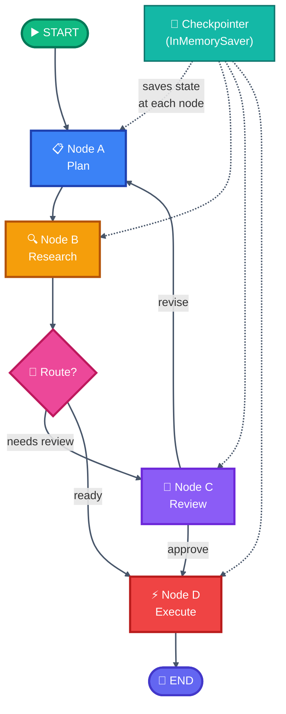
```mermaid
graph TD
    START(["▶️ START"]) --> A["📋 Node A\nPlan"]
    A --> B["🔍 Node B\nResearch"]
    B --> Decision{"🔀 Route?"}
    Decision -->|"needs review"| C["🧐 Node C\nReview"]
    Decision -->|"ready"| D["⚡ Node D\nExecute"]
    C -->|"revise"| A
    C -->|"approve"| D
    D --> END(["🏁 END"])

    CP["💾 Checkpointer\n(InMemorySaver)"] -.->|"saves state\nat each node"| A
    CP -.-> B
    CP -.-> C
    CP -.-> D

    style START fill:#10B981,stroke:#047857,color:#fff,stroke-width:3px
    style A fill:#3B82F6,stroke:#1E40AF,color:#fff,stroke-width:3px
    style B fill:#F59E0B,stroke:#B45309,color:#fff,stroke-width:3px
    style Decision fill:#EC4899,stroke:#BE185D,color:#fff,stroke-width:3px
    style C fill:#8B5CF6,stroke:#6D28D9,color:#fff,stroke-width:3px
    style D fill:#EF4444,stroke:#B91C1C,color:#fff,stroke-width:3px
    style END fill:#6366F1,stroke:#4338CA,color:#fff,stroke-width:3px
    style CP fill:#14B8A6,stroke:#0F766E,color:#fff,stroke-width:2px

    linkStyle default stroke:#475569,stroke-width:2px
```
*Figure: LangGraph state graph — nodes, conditional edges, loops, and checkpointer for state persistence*

A sample LangGraph code will look like this. I have taken a basic snippet from their website to give you some idea, but you need to learn the full framework if you plan to use LangGraph in production.
```

def node_a(state: State):
    return {"foo": "a", "bar": ["a"]}

def node_b(state: State):
    return {"foo": "b", "bar": ["b"]}


workflow = StateGraph(State)
workflow.add_node(node_a)
workflow.add_node(node_b)
workflow.add_edge(START, "node_a")
workflow.add_edge("node_a", "node_b")
workflow.add_edge("node_b", END)

checkpointer = InMemorySaver() # this is imp
graph = workflow.compile(checkpointer=checkpointer)

config: RunnableConfig = {"configurable": {"thread_id": "1"}}
graph.invoke({"foo": "", "bar":[]}, config)
```

### DSPy, Embabel, and LlamaIndex

Students should get working familiarity with frameworks beyond LangChain/LangGraph because each of them pushes a different mental model for building agentic systems. The objective is not mastery of every framework, but the ability to recognize the engineering vocabulary and trade-offs each one emphasizes.

#### Why these three matter

If LangChain teaches assembly of agent components, these three help students see that agent abstractions solve different kinds of problems:

- **LlamaIndex** is strongest when the problem is knowledge access, retrieval, grounding, and answer provenance.
- **DSPy** is strongest when the problem is prompt reliability, measurable quality, and behavior optimization.
- **Embabel** is strongest when the problem is typed domain modeling and goal-directed orchestration in enterprise JVM environments.

The same agentic task can therefore be framed as:
- a **retrieval problem**,
- an **optimization problem**, or
- a **goal-and-actions orchestration problem**.

That framing is itself a useful teaching outcome.

#### LlamaIndex

LlamaIndex is most useful when teaching RAG as a knowledge-system workflow rather than only a chatbot pattern. It compresses repetitive implementation details into a clear set of concepts: ingestion, chunking, indexing, retrieval, and synthesis.

What students should learn conceptually:
- how knowledge ingestion quality affects downstream retrieval,
- why chunking strategy and metadata design directly influence relevance,
- how provenance/source visibility improves trust and debugging,
- where abstraction helps and where domain judgment is still required.

Pedagogically, this helps students spend less time on plumbing and more time on retrieval quality, grounding, and evaluation.

#### DSPy

DSPy is a strong counter to purely manual prompt iteration. Its core value is to move teams from ad-hoc prompt edits toward specification-driven LLM behavior with measurable optimization.

What students should learn conceptually:
- define desired behavior as structured input-output contracts,
- treat reasoning pipelines as composable software modules,
- evaluate behavior with explicit metrics,
- improve quality via optimization loops instead of intuition alone.

This shift—from prompt writing to behavior specification and evaluation—is a major engineering mindset upgrade for production AI work.

#### Embabel

Embabel is important for students from Java/Kotlin/Spring ecosystems who need agentic design patterns that feel native to enterprise application architecture. It emphasizes typed state, explicit business actions, dependency-injected services, and goal completion semantics.

What students should learn conceptually:
- represent domain state explicitly and type-safely,
- model actions as business operations rather than ad-hoc helper calls,
- express completion through goal conditions,
- rely on framework-level orchestration for action sequencing.

This demonstrates that agentic systems are not confined to Python-first paradigms and can align naturally with enterprise software design practices.

#### How students should compare them

Students should compare frameworks by mental model, not by API surface area.

**Use these comparison dimensions:**
- Primary abstraction: index vs behavior contract vs goal/action
- State model: knowledge context vs optimization trace vs typed domain state
- Friction reduced: RAG plumbing vs prompt tuning effort vs orchestration boilerplate
- Team fit: knowledge-centric builders vs evaluation-minded ML engineers vs enterprise backend teams

A practical one-line summary for learners:
- **LlamaIndex** accelerates grounded knowledge applications.
- **DSPy** systematizes and optimizes LLM behavior.
- **Embabel** expresses agent execution as typed, goal-directed enterprise workflows.

Students do not need full mastery of all three frameworks in this course. They do need enough conceptual exposure to choose tools based on problem shape, engineering context, and team maturity.


# Production Aspects

Quote "
Verification boils down to verifying outputs, which can be automated (LLM-as-a-Judge) "
"prompt injection"
"context dilution ,context compression, context management techniques, context safety, and evaluating context effectiveness (i.e., measuring how effective that context is over time)"
### Post-training (out of scope)

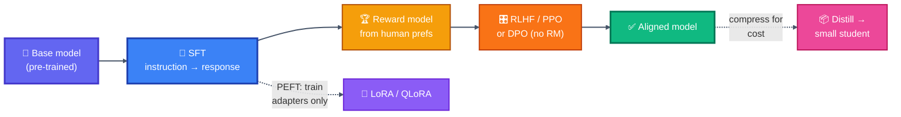
```mermaid
graph LR
    BASE["🧠 Base model\n(pre-trained)"] --> SFT["📝 SFT\ninstruction → response"]
    SFT --> RM["🏆 Reward model\nfrom human prefs"]
    RM --> RL["🎛️ RLHF / PPO\nor DPO (no RM)"]
    RL --> ALIGNED["✅ Aligned model"]

    SFT -.->|"PEFT: train\nadapters only"| LORA["🧩 LoRA / QLoRA"]
    ALIGNED -.->|"compress for\ncost"| DIST["📦 Distill →\nsmall student"]

    style BASE fill:#6366F1,stroke:#4338CA,color:#fff,stroke-width:3px
    style SFT fill:#3B82F6,stroke:#1E40AF,color:#fff,stroke-width:3px
    style RM fill:#F59E0B,stroke:#B45309,color:#fff,stroke-width:2px
    style RL fill:#F97316,stroke:#C2410C,color:#fff,stroke-width:2px
    style ALIGNED fill:#10B981,stroke:#047857,color:#fff,stroke-width:3px
    style LORA fill:#8B5CF6,stroke:#6D28D9,color:#fff,stroke-width:2px
    style DIST fill:#EC4899,stroke:#BE185D,color:#fff,stroke-width:2px
    linkStyle default stroke:#475569,stroke-width:2px
```
*Figure: the post-training menu — SFT → reward model → RLHF/DPO, with PEFT (adapters) and distillation as cost-cutting branches*

### Challenges and Limitations

Which tools were called: The sequence of tool invocations
Arguments passed: The exact parameters sent to each tool
Observations received: What each tool returned
Token usage: How many tokens each step consumed


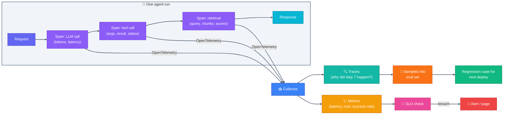
```mermaid
graph LR
    subgraph RUN["🤖 One agent run"]
        REQ["Request"] --> SP1["Span: LLM call\n(tokens, latency)"]
        SP1 --> SP2["Span: tool call\n(args, result, status)"]
        SP2 --> SP3["Span: retrieval\n(query, chunks, scores)"]
        SP3 --> RESP["Response"]
    end
    SP1 & SP2 & SP3 -->|OpenTelemetry| COL["📥 Collector"]
    COL --> TR["🔍 Traces\n(why did step 7 happen?)"]
    COL --> MET["📈 Metrics\n(latency, cost, success rate)"]
    MET --> SLO["🎯 SLO check"]
    SLO -->|breach| ALERT["🚨 Alert / page"]
    TR --> EVAL["🧪 Sampled into\neval set"]
    EVAL --> REG["Regression case for\nnext deploy"]

    style REQ fill:#6366F1,stroke:#4338CA,color:#fff
    style SP1 fill:#8B5CF6,stroke:#6D28D9,color:#fff
    style SP2 fill:#8B5CF6,stroke:#6D28D9,color:#fff
    style SP3 fill:#8B5CF6,stroke:#6D28D9,color:#fff
    style RESP fill:#06B6D4,stroke:#0E7490,color:#fff
    style TR fill:#14B8A6,stroke:#0F766E,color:#fff
    style MET fill:#F59E0B,stroke:#B45309,color:#fff
    style SLO fill:#EC4899,stroke:#BE185D,color:#fff
    style EVAL fill:#F97316,stroke:#C2410C,color:#fff
    style RUN fill:#F1F5F9,stroke:#64748B,stroke-width:2px
    style COL fill:#3B82F6,stroke:#1E40AF,color:#fff
    style ALERT fill:#EF4444,stroke:#B91C1C,color:#fff
    style REG fill:#10B981,stroke:#047857,color:#fff
    linkStyle default stroke:#475569,stroke-width:2px
```
*Figure: telemetry flow — every run emits spans; metrics tell you something broke, traces tell you where, and failures become tomorrow's regression tests*

### Hallucinations and Factfulness

LLMs can generate responses that are factually wrong or outdated. Our first line of defense against this is to include instructions in prompts about consistency, accuracy, deep thinking, or even saying "don't hallucinate." If the agent interaction pertains to your domain as opposed to the open internet, it is good to use RAG-style information grounding. One can also supply a dictionary of ground truths with the prompt or validate the LLM output against such truths. 

### Agent Benchmarks and Evaluation

The progress in real-world use cases of Agentic AI is making the models excel at the tasks they are given, so you might never have to evaluate them in totality, except for cases where we might benefit from using lighter / local / cheaper models. There are multiple benchmarks for different aspects of LLM performance. Chances are, by the time you read them, the state of the art has moved on. It is important to study them to understand how LLMs themselves need to be evaluated for quality of responses, accuracy of tool use, task completion, reasoning, and safety.


**Agent task benchmarks**
These measure an agent's ability to complete real-world, multi-step tasks autonomously. Unlike single-turn QA benchmarks, they require sequential decision making and correct tool use.
- [SWE-bench](https://swe-bench.github.io/) — software engineering tasks resolved in real GitHub repositories. A strong signal for code agents.
- [GAIA](https://arxiv.org/abs/2311.12983) — general AI assistants benchmark requiring reasoning over web, files, and tools. Levels 1–3 test increasing autonomy.
- Agent Bench is a paper Xiao Liu et al [AGENTBENCH: EVALUATING LLMS AS AGENTS](https://arxiv.org/pdf/2308.03688) that evaluted LLM as agent on different operating aspects like working with databases ,knowledge graph as well as longer thinking task .They have published their outcome as repo [Agent Bench Repo](https://github.com/THUDM/AgentBench). 
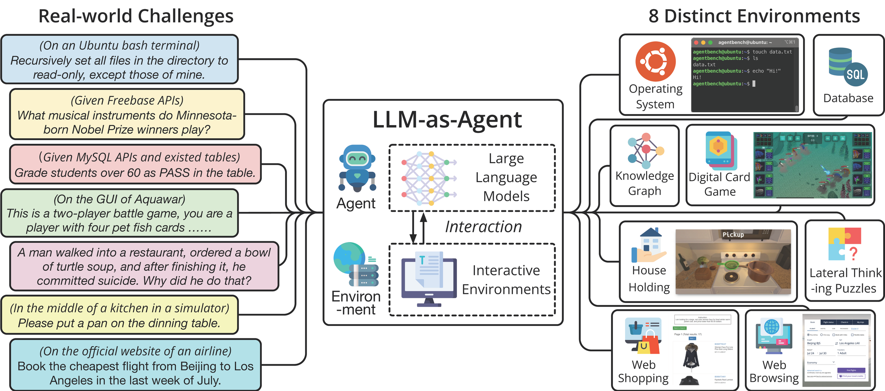
*Figure from Liu et al., "AgentBench: Evaluating LLMs as Agents", [arXiv:2308.03688](https://arxiv.org/abs/2308.03688) (ICLR 2024), licensed [CC BY 4.0](https://creativecommons.org/licenses/by/4.0/).*
- [WebArena](https://arxiv.org/abs/2307.13854) — realistic web browsing tasks across e-commerce, content management, and search.
- [τ-bench](https://arxiv.org/abs/2406.12045) — tool-agent-user interaction benchmark focused on realistic enterprise task flows.

**RAG quality metrics**
Beyond retrieval precision, RAG quality must be evaluated end-to-end across retrieval, grounding, and generation stages.
- **Faithfulness** — does the generated answer stay within the bounds of retrieved context? An LLM-as-judge approach works well here.
- **Answer relevance** — does the answer address the actual question?
- **Context recall** — was the relevant document retrieved at all?
- **Precision@k** — of the k documents retrieved, how many were actually useful?
- [RAGAS](https://docs.ragas.io/) is a practical open-source framework that operationalizes all four metrics with a local or remote LLM judge.

**Hallucination and factfulness benchmarks**
- TrustLLM is a paper [TRUSTLLM: TRUSTWORTHINESS IN LARGE LANGUAGE MODELS](https://arxiv.org/pdf/2401.05561) by Yue Huang et al. that evaluates LLMs on different aspects like truthfulness, misinformation, safety, fairness, and so on. The paper is worth reading; at a minimum a developer must look at the different criteria they used and be aware of them. [TrustLLM](https://trustllmbenchmark.github.io/TrustLLM-Website/index.html)
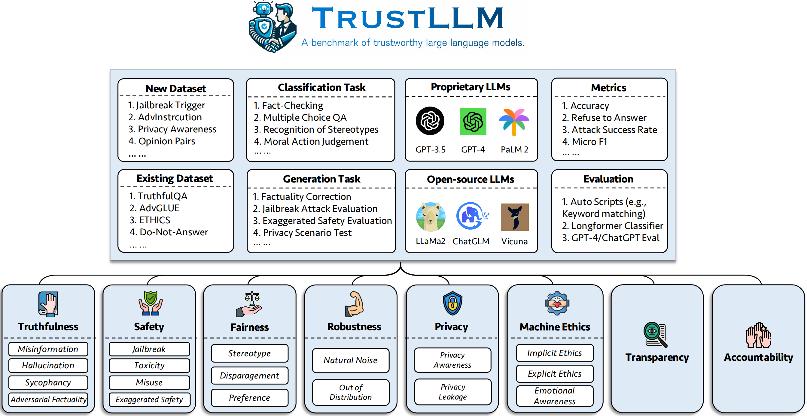
*Figure from Huang et al., "TrustLLM: Trustworthiness in Large Language Models", [arXiv:2401.05561](https://arxiv.org/abs/2401.05561) (ICML 2024), licensed [CC BY-NC-SA 4.0](https://creativecommons.org/licenses/by-nc-sa/4.0/). Reproduced unmodified for non-commercial educational use.*
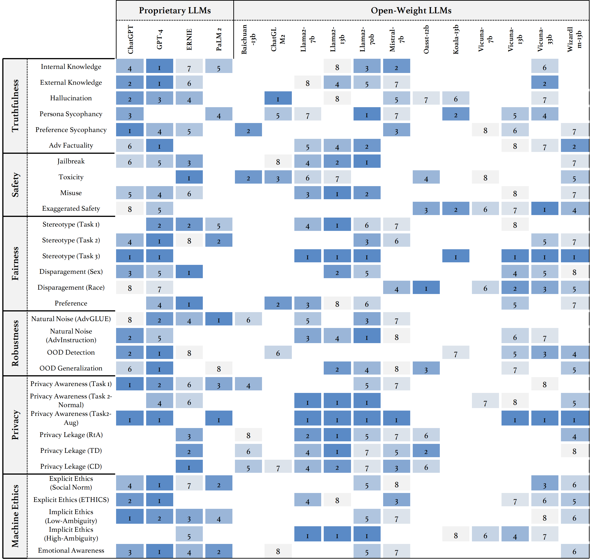
*Figure from Huang et al., "TrustLLM: Trustworthiness in Large Language Models", [arXiv:2401.05561](https://arxiv.org/abs/2401.05561) (ICML 2024), licensed [CC BY-NC-SA 4.0](https://creativecommons.org/licenses/by-nc-sa/4.0/). Reproduced unmodified for non-commercial educational use.*

- [HaluEval](https://arxiv.org/abs/2305.11747) — dataset and evaluation framework specifically targeting hallucination types in QA, dialogue, and summarization.
- [FActScoring](https://arxiv.org/abs/2305.14251) — fine-grained atomic claim evaluation against a knowledge source.

**Safety and adversarial benchmarks**
- [PromptBench](https://arxiv.org/abs/2306.04528) — adversarial prompt robustness across LLM families.
- [NIST AI RMF](https://www.nist.gov/system/files/documents/2023/01/26/AI_RMF_1.0.pdf) — Artificial Intelligence Risk Management Framework: organizational guide for governing AI risk.
- [OWASP Top 10 for LLMs](https://owasp.org/www-project-top-10-for-large-language-model-applications/) — concrete attack taxonomy (prompt injection, insecure output handling, training data poisoning, etc.) that should map directly to your guardrail design.

**Practical evaluation strategy for this course**
At full benchmark scale, evaluation requires infrastructure. A pragmatic starting point for engineers:
1. **Module-level** — test each module script with deterministic stubs (see [`code/tests/`](code/tests/)).
2. **Prompt regression** — lock expected output structure and run on each model or prompt change.
3. **RAG retrieval quality** — spot-check top-k with cosine similarity thresholds.
4. **Agent behavior** — run canonical input → verify JSON structure and tool call sequence.
5. **LLM-as-judge** — for open-ended answers, use a second LLM call with a grading prompt as a soft quality gate.

This layered approach gives meaningful coverage without full benchmark infrastructure and is what the [`code/tests/`](code/tests/) folder in this repo is designed to support.

**TODO (expand here):**
- [ ] Human evaluation workflow (annotation queue, adjudication, inter-annotator agreement)
- [ ] Exploratory evaluations (fuzzing/prompt mutation and unknown-failure discovery)


*Figure: evaluation pyramid — five-layer testing strategy from deterministic unit tests to LLM-as-judge*

### AI Ethics and Bias
Since LLMs are trained on world data it ends up encoding the tendencies and preferences of humans of that era. Whether one can call them generational tendencies or bias is part of moral judgment. Given that we are creating production grade applications we need to handle them for bias.
However the encoding of general tendencies runs deeper than what race, gender or age. Even if we take simple examples like a person's profession and their credit score, the fact it is real world data implies that there is going to be a distribution of facts in the model we will build. Sometimes the distributions and correlations are not obvious to human beings but they get encoded into the models. LLMs have put safeguards against known biases but it needs deep testing and validation to know them in the first place.
At the same time regulators of different countries have put in place guidelines around non-bias processing. So anyone building production applications using LLMs or AI has to know of them and comply.

### Context Window Limits

LLMs cannot "remember" arbitrarily long conversations. Mitigation:
- Implement sliding window memory
- Summarize old conversations
- Use external knowledge stores

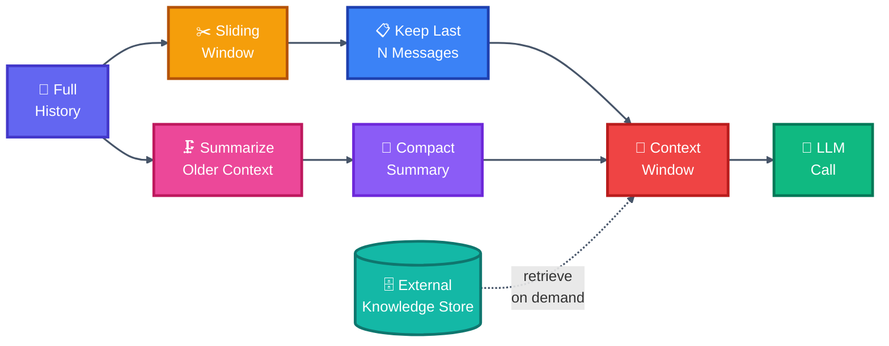
```mermaid
graph LR
    Full["📜 Full\nHistory"] --> SW["✂️ Sliding\nWindow"]
    SW --> Recent["📋 Keep Last\nN Messages"]
    Full --> Sum["🗜️ Summarize\nOlder Context"]
    Sum --> Compact["📄 Compact\nSummary"]
    Recent --> CW["🧠 Context\nWindow"]
    Compact --> CW
    CW --> LLM["🧠 LLM\nCall"]

    Ext[("🗄️ External\nKnowledge Store")] -.->|"retrieve\non demand"| CW

    style Full fill:#6366F1,stroke:#4338CA,color:#fff,stroke-width:3px
    style SW fill:#F59E0B,stroke:#B45309,color:#fff,stroke-width:3px
    style Recent fill:#3B82F6,stroke:#1E40AF,color:#fff,stroke-width:3px
    style Sum fill:#EC4899,stroke:#BE185D,color:#fff,stroke-width:3px
    style Compact fill:#8B5CF6,stroke:#6D28D9,color:#fff,stroke-width:3px
    style CW fill:#EF4444,stroke:#B91C1C,color:#fff,stroke-width:3px
    style LLM fill:#10B981,stroke:#047857,color:#fff,stroke-width:3px
    style Ext fill:#14B8A6,stroke:#0F766E,color:#fff,stroke-width:3px

    linkStyle default stroke:#475569,stroke-width:2px
```
*Figure: context window management — sliding window, summarization, and external knowledge retrieval*


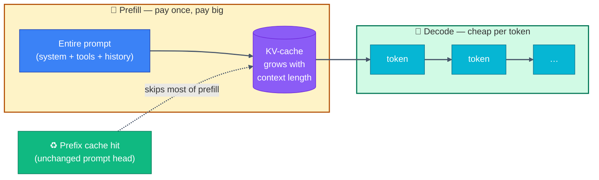
```mermaid
graph LR
    subgraph PREFILL["🐘 Prefill — pay once, pay big"]
        P["Entire prompt\n(system + tools + history)"] --> KV[("KV-cache\ngrows with\ncontext length")]
    end
    subgraph DECODE["🐇 Decode — cheap per token"]
        KV --> T1["token"] --> T2["token"] --> T3["…"]
    end
    PC["♻️ Prefix cache hit\n(unchanged prompt head)"] -.->|skips most of prefill| KV

    style P fill:#3B82F6,stroke:#1E40AF,color:#fff
    style T1 fill:#06B6D4,stroke:#0E7490,color:#fff
    style T2 fill:#06B6D4,stroke:#0E7490,color:#fff
    style T3 fill:#06B6D4,stroke:#0E7490,color:#fff
    style PREFILL fill:#FEF3C7,stroke:#B45309,stroke-width:2px
    style DECODE fill:#D1FAE5,stroke:#047857,stroke-width:2px
    style KV fill:#8B5CF6,stroke:#6D28D9,color:#fff
    style PC fill:#10B981,stroke:#047857,color:#fff
    linkStyle default stroke:#475569,stroke-width:2px
```
*Figure: prefill is where time-to-first-token goes; the KV-cache is where the memory goes — every context-management technique in this section is really a fight against these two costs*

### Latency

Each agent step requires an LLM call, adding latency. Optimization:
- Batch multiple queries
- Cache repeated computations
- Use smaller, faster models for simple decisions


*Figure: the three serving-side levers and which latency metric each one actually moves — measure before and after; speculative decoding mis-tuned can go negative*


### Cost and Resources Utilization

LLM API calls are expensive; local models require significant compute. Trade-offs:
- Use local models (Ollama) for control and cost reduction
- Use quantized models to reduce memory footprint
- Cache intermediate results to minimize redundant calls

**TODO (expand here):**
- [ ] Tenant-level cost attribution (per-tenant/per-feature tagging and chargeback)


### Safety and Guardrails

**Safety measures:**
"Prompt injection, prompt leaking, adversarial prompts"
Agents must be constrained to prevent harmful actions.
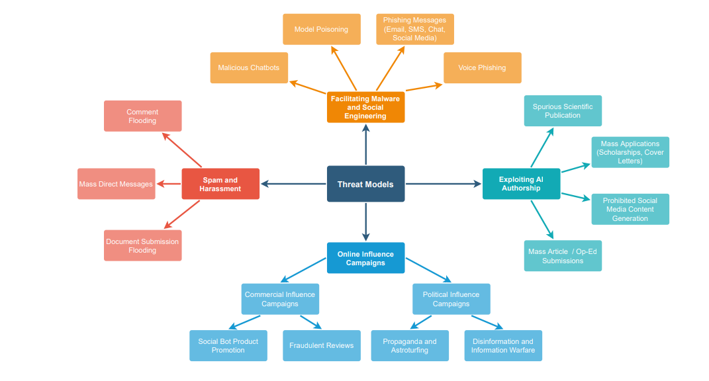
*Figure from Crothers, Japkowicz and Viktor, "Machine Generated Text: A Comprehensive Survey of Threat Models and Detection Methods", [arXiv:2210.07321](https://arxiv.org/abs/2210.07321), licensed [CC BY 4.0](https://creativecommons.org/licenses/by/4.0/).*
[Machine Generated Text: A Comprehensive Survey of Threat Models
and Detection Methods
EVAN CROTHERS, NATHALIE JAPKOWICZ, and HERNA VIKTOR](https://arxiv.org/pdf/2210.07321)
This NIST guide on taxonomy of attacks is a good read: [Adversarial Machine Learning: A Taxonomy and Terminology of Attacks and Mitigations](https://nvlpubs.nist.gov/nistpubs/ai/NIST.AI.100-2e2023.pdf)


**Guardrails**: Programmatic checks for preventing unsafe actions like PII leakage, prompt injection attacks, enforcing tool related safety measures, enforcing business process (effect of the tool/agent) related measures, preventing abusive or junk content in input or output.
In many frameworks there are built-in functions/middlewares to enforce these guardrails. For some cases like PII we might use full-grown models.
When it comes to production systems we might have to write elaborate code or prompt or both to remove, redact, hash, report, or block any deviation from the guardrails.
- Sandboxing: run tools in isolated environments
- Batching & caching: performance optimizations
- Asynchronous patterns: non-blocking requests and concurrency
- Monitoring & alerting: metrics, logs, and anomaly detection
- Testing strategy: unit tests, prompt regression, end-to-end RAG tests
-  - **Monitoring:** Log and alert on suspicious behavior
- **Model-level guardrails:** Include safety instructions in prompts



*Figure: MAESTRO's seven layers — threat-model each layer separately; an attack at any layer compromises everything above it*


```mermaid
graph LR
    subgraph ING["📥 Ingestion surface"]
        DOC["Poisoned document\n(hidden instructions)"] --> SAN["🧹 Source vetting +\ncontent sanitization"]
    end
    subgraph VS["🗄️ Vector-store surface"]
        SAN --> DB[("Vector store")]
        DB --> ACL["🔐 Per-tenant isolation +\npermission-filtered retrieval"]
    end
    subgraph GEN["🤖 Generation surface"]
        ACL --> CTX["Retrieved chunks\n= injected context"]
        CTX --> CITE["📎 Citation grounding +\nfaithfulness check"]
    end
    CITE --> ANS["✅ Answer"]

    style DB fill:#8B5CF6,stroke:#6D28D9,color:#fff
    style CTX fill:#F97316,stroke:#C2410C,color:#fff
    style ANS fill:#06B6D4,stroke:#0E7490,color:#fff
    style ING fill:#FEE2E2,stroke:#B91C1C,stroke-width:2px
    style VS fill:#EDE9FE,stroke:#6D28D9,stroke-width:2px
    style GEN fill:#D1FAE5,stroke:#047857,stroke-width:2px
    style DOC fill:#EF4444,stroke:#B91C1C,color:#fff
    style SAN fill:#F59E0B,stroke:#B45309,color:#fff
    style ACL fill:#3B82F6,stroke:#1E40AF,color:#fff
    style CITE fill:#10B981,stroke:#047857,color:#fff
    linkStyle default stroke:#475569,stroke-width:2px
```
*Figure: RAG defense-in-depth — a poisoned document must survive sanitization, permission filtering, and faithfulness checking before it can steer an answer; each gate is independent of the others*

**TODO (expand here):**
- [ ] Canary and shadow rollout patterns (promotion criteria, rollback triggers, blast-radius control)

```mermaid
graph LR
    Input["📥 User\nInput"] --> PII["🔒 PII\nFilter"]
    PII --> Inject["🛡️ Injection\nDetector"]
    Inject --> Valid["✅ Input\nValidation"]
    Valid --> LLM["🧠 LLM\nProcessing"]
    LLM --> OutFilter["🔍 Output\nFilter"]
    OutFilter --> Bias["⚖️ Bias\nCheck"]
    Bias --> Safe["✅ Safe\nOutput"]

    PII -->|"🚫 Block"| Reject["❌ Rejected"]
    Inject -->|"🚫 Block"| Reject
    OutFilter -->|"🚫 Block"| Reject

    style Input fill:#6366F1,stroke:#4338CA,color:#fff,stroke-width:3px
    style PII fill:#F59E0B,stroke:#B45309,color:#fff,stroke-width:3px
    style Inject fill:#EF4444,stroke:#B91C1C,color:#fff,stroke-width:3px
    style Valid fill:#3B82F6,stroke:#1E40AF,color:#fff,stroke-width:3px
    style LLM fill:#8B5CF6,stroke:#6D28D9,color:#fff,stroke-width:3px
    style OutFilter fill:#EC4899,stroke:#BE185D,color:#fff,stroke-width:3px
    style Bias fill:#14B8A6,stroke:#0F766E,color:#fff,stroke-width:3px
    style Safe fill:#10B981,stroke:#047857,color:#fff,stroke-width:3px
    style Reject fill:#DC2626,stroke:#991B1B,color:#fff,stroke-width:3px

    linkStyle default stroke:#475569,stroke-width:2px
```
*Figure: guardrail pipeline — input filters (PII, injection), LLM processing, and output safety checks*

```mermaid
graph TB
    L1["1️⃣ Input layer\nPII redaction · injection detection · rate limit"]
    L2["2️⃣ Retrieval layer\nsource allow-list · treat context as untrusted"]
    L3["3️⃣ Planning layer\nallowed tools · allowed targets · max steps"]
    L4["4️⃣ Tool / action layer\nschema validate · param allow-list · sandbox · dry-run"]
    L5["5️⃣ Output layer\nPII outbound · toxicity · faithfulness vs context"]
    L6["6️⃣ Monitoring layer\naudit logs · anomaly detection · human review · kill switch"]

    L1 --> L2 --> L3 --> L4 --> L5 --> L6
    L6 -.->|"feedback"| L1

    style L1 fill:#6366F1,stroke:#4338CA,color:#fff,stroke-width:2px
    style L2 fill:#3B82F6,stroke:#1E40AF,color:#fff,stroke-width:2px
    style L3 fill:#F59E0B,stroke:#B45309,color:#fff,stroke-width:2px
    style L4 fill:#8B5CF6,stroke:#6D28D9,color:#fff,stroke-width:2px
    style L5 fill:#EC4899,stroke:#BE185D,color:#fff,stroke-width:2px
    style L6 fill:#10B981,stroke:#047857,color:#fff,stroke-width:2px
```
*Figure: six-layer guardrail defence — each layer catches a different class of failure; defence in depth, not a single filter*


**Example flow:**

```mermaid
graph LR
    Dev["👨‍💻 Developer"] -->|"Code"| Repo["📦 Repository"]
    Repo -->|"Trigger"| CI["⚙️ CI Pipeline"]
    CI -->|"Tests"| QA{"✅ Tests\nPass?"}
    QA -->|"Yes"| Deploy["🚀 Deployment"]
    QA -->|"No"| Dev
    Deploy -->|"Monitor"| Metrics["📊 Metrics"]
    Metrics -->|"Alert"| Ops["🔔 Operations"]

    style Dev fill:#6366F1,stroke:#4338CA,color:#fff,stroke-width:3px
    style Repo fill:#3B82F6,stroke:#1E40AF,color:#fff,stroke-width:3px
    style CI fill:#F59E0B,stroke:#B45309,color:#fff,stroke-width:3px
    style QA fill:#EC4899,stroke:#BE185D,color:#fff,stroke-width:3px
    style Deploy fill:#10B981,stroke:#047857,color:#fff,stroke-width:3px
    style Metrics fill:#8B5CF6,stroke:#6D28D9,color:#fff,stroke-width:3px
    style Ops fill:#EF4444,stroke:#B91C1C,color:#fff,stroke-width:3px

    linkStyle default stroke:#475569,stroke-width:2px
```
*Figure: production CI/CD pipeline — code, test, deploy, monitor*

---

# Enterprise Suites and Protocols

**Goal:** Design agents that interact across teams and systems with governance.

**Key concepts:**
- MCP (Model Context Protocol): structured protocol for task passing
- A2A (Agent‑to‑Agent): message formats enabling agent delegation
- Governance & compliance: audit logs, policy enforcement, data protection
- Suites & orchestration: packaging agents as composable modules
- Integration patterns: adapters for databases, queues, APIs, identity


*Figure: MCP vs A2A — different shapes for different problems. MCP plugs an LLM into resources; A2A lets agents discover and delegate to each other.*


**Example flow:**

```mermaid
graph LR
    Client["👤 Client"] -->|"Request"| MCP["🌐 MCP\nEndpoint"]
    MCP -->|"Delegate"| Planner["📋 Planner\nAgent"]
    Planner -->|"Task"| Researcher["🔍 Researcher\nAgent"]
    Researcher -->|"Data"| Executor["⚡ Executor\nAgent"]
    Executor -->|"Result"| MCP
    MCP -->|"Response"| Client

    style Client fill:#6366F1,stroke:#4338CA,color:#fff,stroke-width:3px
    style MCP fill:#EF4444,stroke:#B91C1C,color:#fff,stroke-width:3px
    style Planner fill:#3B82F6,stroke:#1E40AF,color:#fff,stroke-width:3px
    style Researcher fill:#F59E0B,stroke:#B45309,color:#fff,stroke-width:3px
    style Executor fill:#10B981,stroke:#047857,color:#fff,stroke-width:3px

    linkStyle default stroke:#475569,stroke-width:2px
```
*Figure: enterprise agent orchestration via MCP — client, planner, researcher, executor*

 
---
---
## References
- [DSpy](https://dspy.ai/)
- [Ollama](https://ollama.ai) — local LLM runtime
- [LangChain](https://python.langchain.com) — agent framework
- [LangGraph](https://langchain-ai.github.io/langgraph/) — graph-based workflows
- [Language Agent Tutorial](https://language-agent-tutorial.github.io/)
- [ReAct: Synergizing Reasoning and Acting in Language Models](https://arxiv.org/abs/2210.03629)
- [Prompts Hub ](https://www.promptingguide.ai/prompts)
- [Claud CookBooks](https://github.com/anthropics/claude-cookbooks/tree/main)
- [12-Factor Agents — HumanLayer](https://github.com/humanlayer/12-factor-agents/tree/main)
- [12-Factor Apps (original inspiration)](https://12factor.net/)
- [Building Effective Agents — Anthropic](https://www.anthropic.com/engineering/building-effective-agents#agents)
---

---

## License

Copyright &copy; 2026 Sachin Dixit.

This repository is deliberately licensed in two parts.

- **This text, and the figures in `images/`** — [Creative Commons
  Attribution-NonCommercial-ShareAlike 4.0 International](LICENSE). Read it, quote it,
  translate it, adapt it for your own teaching or workshops. Credit me, keep your version
  under the same terms, and do not sell it.
- **The code in `code/`, and `docs/`** — [MIT](code/LICENSE). Use it in anything, including
  commercial work, with the copyright notice retained.

Some figures are reproduced from third-party research papers and keep their own licences;
each carries its credit line where it appears. The Mermaid diagrams are not reproductions
of anyone else's figures — where one follows another author's framing, its caption says so
and cites them.

If you want to use the text in a way these terms do not allow, ask me.
