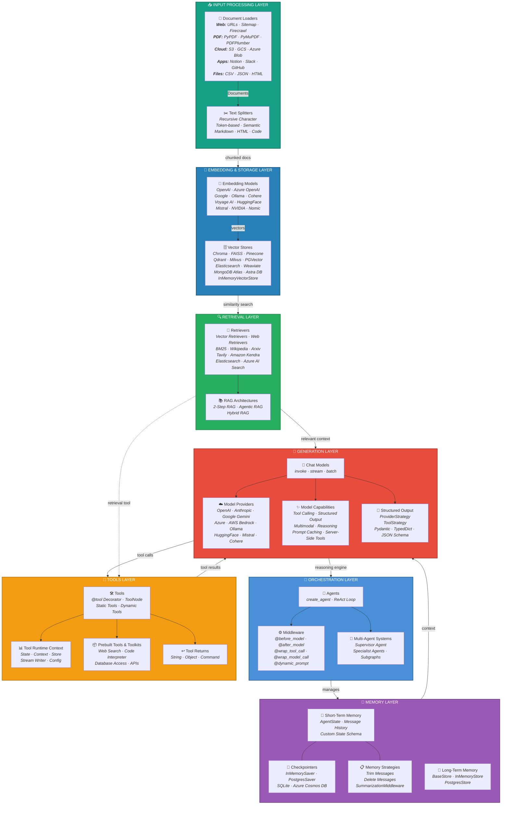

# LangChain Component Architecture - Detailed Ecosystem Diagram

> Based on the official LangChain documentation: [Component Architecture](https://docs.langchain.com/oss/python/langchain/component-architecture)


*Figure: LangChain component ecosystem — orchestration, memory, generation, tools, retrieval, embedding, and input processing layers*

<details>
<summary>Mermaid Source</summary>



</details>

---

## Component Categories Reference

### 1. Models (Generation Layer)
| Aspect | Details |
|--------|---------|
| **Core Interface** | `init_chat_model()`, `BaseChatModel` |
| **Key Methods** | `invoke()`, `stream()`, `batch()`, `batch_as_completed()` |
| **Providers** | OpenAI, Anthropic, Google Gemini, Azure, AWS Bedrock, Ollama, HuggingFace, Mistral, Cohere |
| **Capabilities** | Tool Calling, Structured Output, Multimodal (image/audio/video), Reasoning, Prompt Caching, Server-Side Tools |
| **Structured Output** | `ProviderStrategy` (native), `ToolStrategy` (via tool calling), Pydantic / TypedDict / JSON Schema |
| **Advanced** | Model Profiles, Configurable Models, Rate Limiting, Log Probabilities, Token Usage Tracking |
| **Parameters** | `model`, `api_key`, `temperature`, `max_tokens`, `timeout`, `max_retries` |

### 2. Tools
| Aspect | Details |
|--------|---------|
| **Creation** | `@tool` decorator, Pydantic `args_schema`, JSON Schema |
| **Types** | Static Tools, Dynamic Tools (state-filtered, runtime-registered) |
| **Execution** | `ToolNode` (parallel execution, error handling, state injection) |
| **Runtime Context** | `ToolRuntime` → State, Context, Store, Stream Writer, Config, Tool Call ID |
| **Return Types** | String, Object (dict), `Command` (state updates) |
| **Error Handling** | `@wrap_tool_call` middleware, `handle_tool_errors` on ToolNode |
| **Prebuilt** | Web Search, Code Interpreter, Database Access, APIs, Server-side tools |
| **Routing** | `tools_condition` for conditional graph edges |

### 3. Agents (Orchestration Layer)
| Aspect | Details |
|--------|---------|
| **Core** | `create_agent()` → LangGraph-based runtime |
| **Pattern** | ReAct loop (Reasoning + Acting) |
| **Model Selection** | Static (fixed model) or Dynamic (middleware-based routing) |
| **Tool Management** | Static tools, Dynamic tools (state/context/runtime filtered) |
| **System Prompt** | Static string, `SystemMessage`, Dynamic via `@dynamic_prompt` middleware |
| **Structured Output** | `response_format` → `ProviderStrategy` / `ToolStrategy` |
| **Streaming** | `stream()` with `stream_mode="values"` |
| **Multi-Agent** | Supervisor + Specialist agents, named subgraphs |

### 4. Memory
| Aspect | Details |
|--------|---------|
| **Short-Term** | `AgentState` (messages + custom fields), thread-scoped |
| **Long-Term** | `BaseStore` → `InMemoryStore`, `PostgresStore` (namespace/key pattern) |
| **Checkpointers** | `InMemorySaver`, `PostgresSaver`, SQLite, Azure Cosmos DB |
| **Strategies** | Trim Messages, Delete Messages, `SummarizationMiddleware` |
| **Access Points** | Tools (`ToolRuntime`), Prompts (`@dynamic_prompt`), Middleware (`@before_model`, `@after_model`) |

### 5. Retrievers
| Aspect | Details |
|--------|---------|
| **Interface** | Returns `Document` objects given string query |
| **Custom Index** | `AmazonKnowledgeBasesRetriever`, `ElasticsearchRetriever`, `AzureAISearchRetriever`, `NVIDIARetriever` |
| **External Index** | `ArxivRetriever`, `TavilySearchAPIRetriever`, `WikipediaRetriever`, BM25 |
| **From Vector Stores** | All vector stores can be cast to retrievers via `.as_retriever()` |
| **RAG Architectures** | 2-Step RAG, Agentic RAG, Hybrid RAG |

### 6. Document Processing (Input Layer)
| Aspect | Details |
|--------|---------|
| **Loaders** | Web (URLs, Sitemap, Firecrawl, Spider), PDF (PyPDF, PyMuPDF, PDFPlumber, PDFMiner), Cloud (S3, GCS, Azure Blob, Google Drive, OneDrive, SharePoint), Apps (Notion, Slack, GitHub, Figma, Trello), Files (CSV, JSON, HTML, Unstructured, Docling) |
| **Text Splitters** | Recursive Character, Token-based, Semantic, Markdown, HTML, Code |
| **Interface** | `load()`, `lazy_load()` → `Document(page_content, metadata)` |

### 7. Vector Stores (Embedding & Storage Layer)
| Aspect | Details |
|--------|---------|
| **Interface** | `add_documents()`, `delete()`, `similarity_search()` |
| **Implementations** | Chroma, FAISS, Pinecone, Qdrant, Milvus, PGVector, Elasticsearch, Weaviate, MongoDB Atlas, Astra DB, InMemoryVectorStore, Azure Cosmos DB, CockroachDB |
| **Embedding Models** | OpenAI, Azure OpenAI, Google, Ollama, Cohere, Voyage AI, HuggingFace, Mistral, NVIDIA, Nomic |
| **Similarity Metrics** | Cosine Similarity, Euclidean Distance, Dot Product |
| **Features** | Metadata filtering, HNSW indexing, Embedding caching (`CacheBackedEmbeddings`) |

---

## Data Flow Summary

```
Input Sources → Document Loaders → Text Splitters → Embedding Models → Vector Stores
                                                                            ↓
User Query → Embedding Model → Query Vector → Retriever → Relevant Context → Chat Model
                                                                                ↓
                                                            Agent (ReAct Loop) ↔ Tools
                                                                    ↓
                                                            Memory (Short/Long-Term)
                                                                    ↓
                                                              Final Response
```
